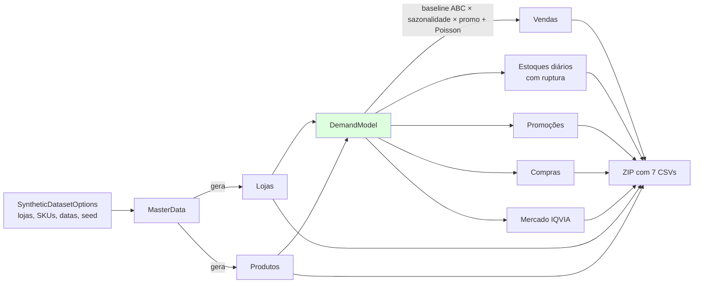
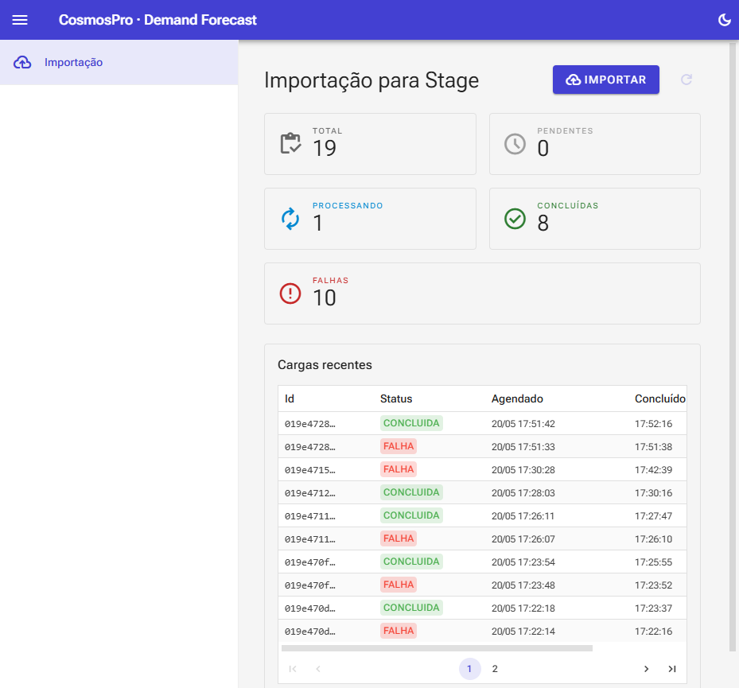

# 01 — Dataset Sintético Farma

> Fase **F4** do roadmap · projeto [CosmosPro.ML.DemandForCast.SyntheticData](../CosmosPro.ML.DemandForCast.SyntheticData/)

## O quê

Um **gerador procedural** de dataset de varejo farmacêutico que produz, em segundos, 7 CSVs no mesmo formato que uma rede real exportaria: lojas, produtos, vendas, estoques diários, compras, promoções e mercado IQVIA. O dataset é **sintético** mas **realista**: respeita curva ABC, sazonalidade, ruptura, promoções e mercado externo.

## Por quê

1. **Validar o pipeline sem precisar de dado real.** ML POC exige iterações rápidas; depender de uma extração de produção mata o ciclo.
2. **Privacidade.** Dado farma real é sensível (PMC, prescrição, controlados). O CLAUDE.md proíbe versionar dump real.
3. **Verdade de campo conhecida.** Quando você sabe a "fórmula" que gerou os dados, consegue auditar se o modelo aprendeu o que devia (curva ABC visível, sazonalidade semanal capturada, etc.).
4. **Reprodutibilidade total.** Mesmo `seed` → mesmo dataset, byte a byte. Crítico para o TCC poder ser replicado por outros.

## Como — visão geral

## Os ingredientes, um por um

### 1. Curva ABC (Pareto / Power-law) {#abc}

#### Conceito

Em varejo (farma especialmente), **as vendas não se distribuem uniformemente entre os SKUs**. Tipicamente 20% dos itens respondem por 70-80% do volume. É a famosa "regra 80/20" formalizada como [lei de Pareto](https://en.wikipedia.org/wiki/Pareto_principle).

Modelamos isso com uma **power-law (lei de potência)**: o SKU de rank $i$ tem baseline de demanda

$$
\text{baseline}_i = c \cdot \left(\frac{1}{i}\right)^{\alpha} + \epsilon
$$

com $c = 80$, $\alpha = 1{,}2$, $\epsilon = 0{,}05$. Quanto maior o $\alpha$, mais "concentrada" a curva.

#### Por que importa para o modelo

Um SKU classe A vende **dezenas de unidades/dia/loja**; um classe C vende **uma a cada várias semanas**. O modelo precisa lidar com essas duas realidades simultaneamente — caso contrário, a métrica média do modelo (WAPE) é dominada pela cauda longa de itens raros e a previsão dos itens A (que dominam o valor) fica ruim.

Daí a importância do **drill-down por classe ABC** ([doc 04 — Avaliação](04-avaliacao-metricas.md#drill-down)) e do **modelo global** com SKU como feature ([doc 05](05-pipeline-treino-completo.md)).

#### No nosso gerador

Com 25 SKUs e seed 42, o top 20% concentrou **66,3% do volume** total — sinal forte (validado por unit test `Curva_ABC_concentra_vendas_nos_top_SKUs`).

### 2. Sazonalidade {#sazonalidade}

O baseline é multiplicado por **três fatores temporais**:

#### Semanal

Tipicamente em farma, fim-de-semana tem dinâmica diferente:
- Sábado: pico de procura por consumo de fim-de-semana, **fator 1.5**
- Domingo: maioria fechada ou movimento reduzido, **fator 0.6**
- Seg-Sex: nivelado, **fator 1.0**

#### Anual

Modelado como uma senoidal centrada em julho (inverno BR, pico de gripe/respiratório):

$$
f_{\text{anual}}(d) = 1 + 0{,}15 \cdot \cos\left(\frac{(d_{\text{ano}} - 200)}{365} \cdot 2\pi\right)
$$

Amplitude de 15% é conservadora — em produção pode ser maior para certas categorias.

#### Feriados (calendário BR)

Tratados como **feature**, não como ajuste da demanda. O modelo aprende sozinho como cada categoria reage a Carnaval, Natal, etc. Implementado em [BrazilianHolidays.cs](../CosmosPro.ML.DemandForCast.Features/BrazilianHolidays.cs) com **algoritmo de Computus** (Meeus/Jones/Butcher) para datas móveis derivadas da Páscoa (Carnaval, Sexta Santa, Corpus Christi).

### 3. Promoções

- **~5% dos SKUs** recebem uma promoção em uma janela aleatória de **7 a 14 dias** no horizonte.
- Dentro da janela, o multiplicador de demanda fica entre **2,0 e 3,0×** (uniforme).
- Cada SKU em promo tem um desconto fixo entre **10% e 30%**.

A "verdade" da promoção é registrada na CSV `promocoes.csv` — o modelo a usa como **feature conhecida do futuro** (a promoção é planejada antes; portanto o forecast pode usá-la sem leakage). Ver [02 — Feature Engineering](02-feature-engineering.md#promo-future-known).

### 4. Ruptura (stockout) {#ruptura}

Modelada com probabilidade **assimétrica por rank ABC**:

| Rank | Probabilidade base de ruptura/dia |
|---|---|
| Top 50 SKUs (alto giro) | $0{,}03 \times 0{,}5 = 1{,}5\%$ |
| Cauda (rank > 70%) | $0{,}03 \times 2{,}5 = 7{,}5\%$ |
| Demais | $3\%$ |

**Lógica de negócio:** itens classe A são monitorados de perto pela operação (ruptura é "incidente"). Itens da cauda têm reposição mais frouxa, então ruptura crônica é normal.

Quando há ruptura, **a venda observada é 0** mesmo havendo demanda → grande problema metodológico tratado em [02 — Feature Engineering](02-feature-engineering.md#ruptura).

### 5. IQVIA (mercado simulado)

[IQVIA](https://www.iqvia.com/) é a fonte de dados de mercado farma que muitas redes consomem. O dataset gera uma **simulação simplificada**: para cada combinação (mês × princípio ativo × UF), uma demanda total de mercado entre 5k e 50k unidades + um market share da rede entre 5-25%.

No POC, **IQVIA entra como feature exógena** (sinal de "como está o mercado da molécula em geral") — não é base de treino independente. Ver [tcc_context](../README.md#L17).

### 6. Ruído estocástico (Poisson)

Em vez de produzir o valor exato do baseline, geramos uma realização **Poisson**:

$$
Y \sim \text{Poisson}(\lambda), \quad \lambda = \text{baseline}_i \cdot f_{\text{sem}} \cdot f_{\text{anual}} \cdot f_{\text{promo}}
$$

#### Por que Poisson e não Normal?

- **Demanda é contagem**: você vende 0, 1, 2, ... unidades, nunca −3 ou 1,7.
- **Variância proporcional à média** ($\text{Var}[Y] = \lambda$): casa com a observação empírica de varejo (itens A flutuam mais em valor absoluto que itens C).
- **Suporta zero naturalmente** sem hacks: $P(Y=0 \mid \lambda \text{ pequeno})$ é alta.

Para $\lambda > 30$ usamos aproximação normal por performance (Knuth fica lento). Para $\lambda$ pequeno, sampler clássico de Knuth.

## Tela: gerando dataset pela UI

A página de Importação tem o botão **"Gerar dados sintéticos"** que dispara o endpoint `POST /api/imports/synthetic`. A geração roda em ~1-2s para 20 lojas × 500 SKUs × 12 meses.

## Trade-offs e leituras

### Limitações deliberadas

- **Sem dependência cruzada entre SKUs.** No mundo real, paracetamol e dipirona se canibalizam. Aqui são independentes. Para o POC isso é OK; um cenário mais sofisticado modelaria correlação.
- **Sem efeito de preço dinâmico.** Promoção é tratada como multiplicador fixo; não há modelo de elasticidade. Adicionar elasticidade é trabalho para fora do POC.
- **IQVIA fake**, não correlacionada com nossas vendas. Em produção, IQVIA traz sinal antecipado de tendência (a rede vê o mercado mexer antes de sentir nela própria); aqui só serve como **placeholder para a feature exógena**.

### Onde isto se conecta com seu TCC

Você pode argumentar que **a comparação eMax/eSeg × ML faz mais sentido em dataset com complexidade controlada**: você sabe que a "verdade de campo" tem sazonalidade semanal e curva ABC, então sabe o que esperar do modelo. Se o ML não capturar o que o gerador colocou, há bug no pipeline; se capturar, dá pra investigar o ganho marginal em cada dimensão.

### Referências para citar

- **Pareto / curva ABC em inventário:** Silver, E. A., Pyke, D. F., & Thomas, D. J. (2016). *Inventory and Production Management in Supply Chains* — capítulo sobre classificação ABC.
- **Distribuição Poisson para contagem de demanda:** Hyndman, R. J., & Athanasopoulos, G. (2021). *Forecasting: Principles and Practice* — seção "Count time series".
- **Algoritmo de Computus para datas da Páscoa:** Meeus, J. (1991). *Astronomical Algorithms*, cap. 8.
- **Lei de Zipf / power-law em distribuições naturais:** Newman, M. E. J. (2005). "Power laws, Pareto distributions and Zipf's law". *Contemporary Physics*, 46(5), 323–351.

## Próxima leitura

→ [02 — Feature Engineering](02-feature-engineering.md): com o dataset gerado, como transformar isso em entrada para o modelo de ML sem cair em armadilhas de leakage.
