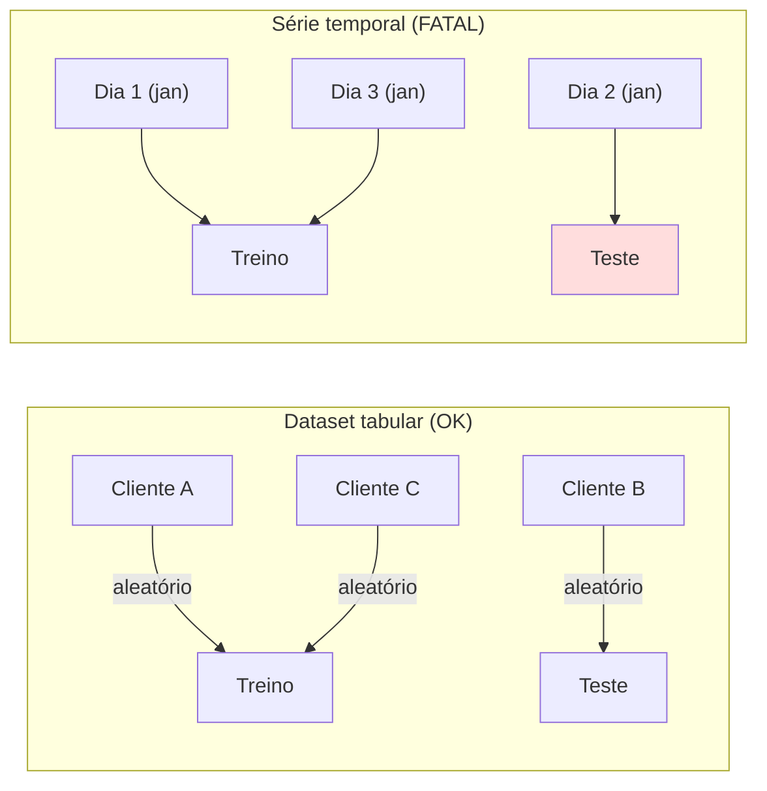
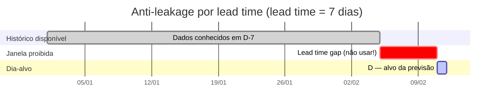
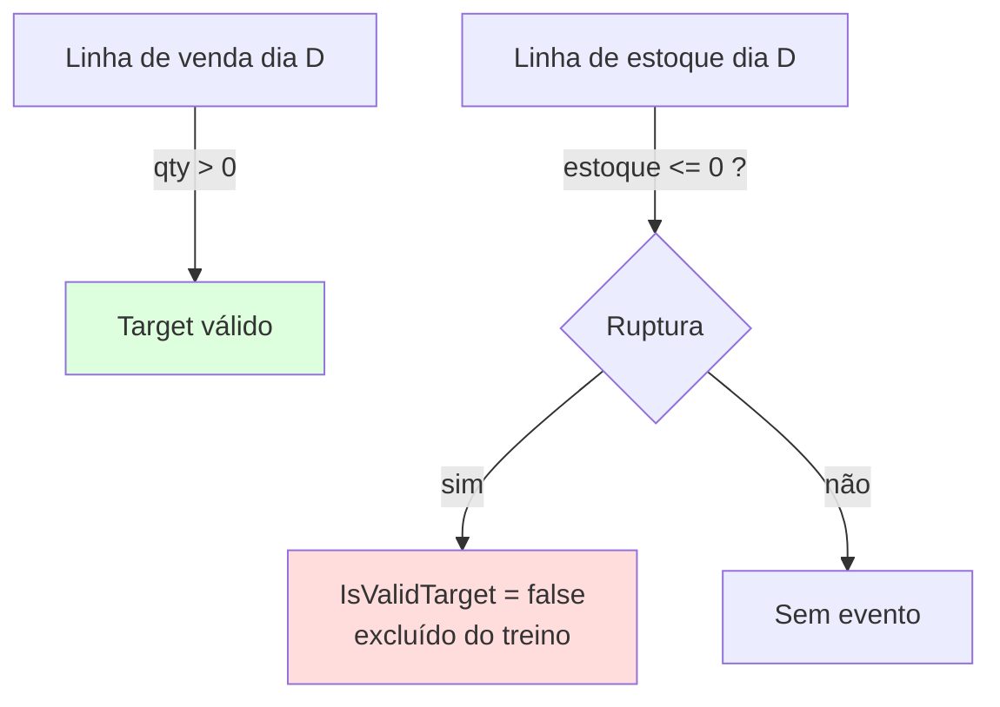

# 02 — Feature Engineering

> Fase **F5** do roadmap · projeto [CosmosPro.ML.DemandForCast.Features](../CosmosPro.ML.DemandForCast.Features/)

## O quê

**Feature engineering** é o processo de transformar dados brutos (vendas históricas, estoques, promoções) em **vetores numéricos / categóricos** que um algoritmo de ML consegue processar. No nosso projeto, isso significa: dada uma observação diária de venda por SKU × loja, gerar uma linha com ~25 colunas que descrevem o passado, o presente e o conhecido do futuro de forma que o modelo possa aprender padrões.

A saída do F5 — uma lista de `FeatureVector` — é a entrada de **todo engine** ([doc 03](03-engines-previsao.md)).

## Por quê

> *"Garbage in, garbage out."* Em ML, isso não é metáfora — é matemática.

O modelo só "enxerga" o que você der como feature. Um dataset de varejo bruto (linha = uma venda) não é treinável diretamente: não tem histórico, não tem sazonalidade explícita, não tem hierarquia.

Mais importante: **a forma como você arruma as features determina se o modelo é honesto ou trapaceiro**. Esta doc é, na prática, sobre como **não deixar o modelo trapacear** (anti-leakage).

## Série temporal vs dataset tabular {#serie-temporal}

Em ML "comum" (classificar imagens, prever se cliente vai cancelar), você pode embaralhar as linhas livremente e fazer train/test split aleatório. **Em série temporal, isso é proibido**:



Por que é fatal? Porque o "dia 2" no teste **veio do mesmo período** que o dia 1 do treino. O modelo está aprendendo padrões do meio de janeiro e sendo avaliado em outros pontos do meio de janeiro — **não em pontos do futuro**, que é o caso de uso real.

A versão honesta — `walk-forward` — está em [04 — Avaliação](04-avaliacao-metricas.md#walk-forward). Mas o **anti-leakage começa na feature engineering**, antes do split.

## Lead time {#lead-time}

#### Conceito

**Lead time** é o tempo entre **decidir comprar** e **a mercadoria estar disponível** para venda. É um número de negócio, não de ML.

| Etapa | Tempo (exemplo) |
|---|---|
| Decidir o quanto comprar | dia D − 7 |
| Pedido sai para o fornecedor | dia D − 7 |
| Recebimento | dia D − 2 |
| Disponível para venda | dia D − 0 |

Para nossa modelagem, simplificamos: **a decisão de compra para o dia D acontece em D − 7**. O lead time é **7 dias**.

#### Por que isso muda tudo

Se o lead time é 7 dias e estamos prevendo a demanda do dia D, **no momento da previsão (D − 7) só podemos usar dados disponíveis em D − 7 ou antes**. Tentar usar a venda de D − 1 é trapaça — em produção, esse dado **ainda não existe** quando o pedido foi feito.



A "janela proibida" (D − 6 a D − 1) é onde o leakage acontece. **Toda feature de histórico no F5 respeita esta regra.**

## Anti-leakage na prática {#anti-leakage}

#### O teste obrigatório

O `WalkForwardBacktest` injeta um pico gigante (valor 99999) nos dias D−6 a D−1 e verifica que **nenhuma feature de histórico** o captura. Se capturasse, vazaria info do "quase-presente" para o modelo. Este é o **teste mais importante** da suíte:

```csharp
// tests/Forecasting.Tests/WalkForwardBacktestTests.cs
[Fact]
public void Treino_de_cada_fold_nunca_ve_datas_dentro_ou_apos_a_janela_de_teste()
{ ... }
```

#### Cuidado: o anti-leakage começa nas features

Mesmo com walk-forward correto, **se a feature está mal construída**, o leakage passa pelo split.

Exemplo perigoso: "vendas dos últimos 30 dias" sem cuidado pode incluir o dia D − 1, que estaria na "janela proibida". A defesa é sempre **terminar a janela rolling em D − lead_time**, não em D − 1.

## As features do nosso modelo

Todas geradas pelo [FeatureBuilder.cs](../CosmosPro.ML.DemandForCast.Features/FeatureBuilder.cs).

### 1. Lags

> "Quanto vendi K dias atrás?"

Configurados em [FeatureConfig.cs](../CosmosPro.ML.DemandForCast.Features/FeatureConfig.cs): **Lag7, Lag14, Lag21, Lag28**. Cada um respeita o lead time mínimo (= 7), portanto **Lag7 é o lag mais "fresco" permitido**.

#### Por que esses números?

- **Lag7** = mesmo dia da semana → captura sazonalidade semanal sem precisar de feature explícita de dia-da-semana (mas temos a feature de qualquer forma).
- **Lag14, Lag21** = compara com semanas equivalentes → o modelo enxerga tendência.
- **Lag28** ≈ 4 semanas → captura ciclo mensal aproximado.

### 2. Rolling (médias móveis)

> "Em média, quanto vendi nos últimos N dias?"

- `RollMean7` — média móvel de 7 dias terminando em D − 7
- `RollMean28` — média móvel de 28 dias terminando em D − 7
- `RollStd28` — desvio-padrão de 28 dias (volatilidade)
- `RollMax28` — pico recente

Rolling suaviza ruído. Médias móveis são, sozinhas, um baseline clássico (veja [03 — Engines](03-engines-previsao.md#media-movel)).

### 3. Calendário do dia-alvo D

Estas features são **calculadas a partir da data D**, não do histórico — portanto **não vazam**:

| Feature | Tipo | Pra que serve |
|---|---|---|
| `DiaDaSemana` (0-6) | inteiro | Captura sazonalidade semanal explícita |
| `DiaDoMes` | inteiro | Início/fim de mês têm comportamento diferente (pagamento, etc.) |
| `Mes` | inteiro | Sazonalidade anual |
| `FimDeSemana` | bool | Atalho da sazonalidade semanal |
| `Feriado` | bool | Feriado nacional BR via [BrazilianHolidays](../CosmosPro.ML.DemandForCast.Features/BrazilianHolidays.cs) |

### 4. Promoção e preço {#promo-future-known}

Estas são **especiais**: também são features de D, mas o conteúdo é **conhecido com antecedência** porque promoção é planejada e preço de tabela é publicado:

| Feature | O que é |
|---|---|
| `EmPromocao` | Há promoção ativa para o SKU em D |
| `DiasDesdeUltimaPromo` | Quanto tempo desde a última promo (efeito de "depois da promo, queda") |
| `PrecoUnitario` | Preço efetivo planejado para D |
| `PrecoRelativoMedia` | Preço de D ÷ média de preço recente — capta o "tamanho relativo" do desconto |

**Importante:** essas features são lícitas porque a empresa **sabe em D − 7** qual será a promoção em D. Para dados reais, garanta que a tabela de promoções é a versão **planejada antes de D − 7**, não a "executada depois" (o cuidado é não vazar mudanças posteriores).

### 5. Hierarquia (categóricas)

Atributos estáticos do par (SKU, loja):

| Feature | De onde vem |
|---|---|
| `Sku` | id do produto (one-hot ou hash no engine) |
| `Categoria` | OTC, Prescrição, Controlado |
| `PrincipioAtivo` | Dipirona, Paracetamol, ... |
| `ClasseAbc` | A, B ou C (derivada do volume — ver [05](05-pipeline-treino-completo.md)) |
| `UF`, `Regiao`, `PerfilLoja` | Atributos da loja |

#### Por que categóricas explícitas no modelo global

Em um **modelo global** (um único modelo para todos os SKUs), categóricas permitem que o modelo aprenda comportamentos diferentes por grupo — sem precisar treinar um modelo por SKU.

LightGBM lida com isso via one-hot encoding (gera uma coluna binária por valor único). É discutido em [03 — Engines](03-engines-previsao.md#lightgbm).

### 6. Target e máscara de validade

| Campo | O que é |
|---|---|
| `Target` | A quantidade vendida em D — o que o modelo deve prever |
| `IsValidTarget` | `false` quando D está em ruptura → linha NÃO entra no treino nem na avaliação |

## Ruptura: a armadilha mais sutil {#ruptura}

#### O problema

Em farma, dias de **ruptura** (estoque = 0) têm venda = 0 mesmo havendo demanda. Se você não tratar isso, o modelo aprende:

> "SKU X tem zero venda com frequência → demanda é baixa → não preciso prever muito."

Isso é o **anti-pattern explícito do CLAUDE.md §6**: o modelo aprende a **subestimar** SKUs que rupturam frequentemente — exatamente os SKUs que mais precisam de previsão boa.

#### A solução do nosso pipeline

1. O [StageObservationLoader](../CosmosPro.ML.DemandForCast.Worker/Training/StageObservationLoader.cs) injeta dias de ruptura (estoque 0 sem linha em Vendas) como `DailyObservation` com `EmRuptura = true`.
2. O `FeatureBuilder` propaga: o `FeatureVector` correspondente tem `IsValidTarget = false`.
3. O `WalkForwardBacktest` filtra `IsValidTarget == false` **antes** de qualquer cálculo. Linhas em ruptura existem no histórico (para que outros dias possam computar seus lags), mas **nunca viram target de treino nem ponto de avaliação**.



## Densificação de série

Datasets de venda só registram dias com venda > 0. Mas o modelo precisa de **série densa** — sem isso, `Lag7` pegaria "7 vendas atrás" em vez de "7 dias atrás", o que é matematicamente diferente.

O `FeatureBuilder.Densify` preenche dias faltantes (entre primeira e última observação) com `qty = 0`, herdando atributos estáticos do SKU. Isso é correto exceto quando há ruptura — daí a injeção explícita acima.

## Histórico mínimo

Para gerar um `FeatureVector` para o dia D, precisamos de **histórico suficiente**:

$$
D - \min\bigl(\text{lag}_{\max}, \; \text{leadTime} + \text{rollingLongo} - 1\bigr) \geq \text{início}
$$

Com os defaults (`leadTime=7`, `Lag28`, `RollMean28`): histórico mínimo = $\max(28, \; 7 + 28 - 1) = \max(28, 34) = 34$ dias.

Significa: o primeiro dia-alvo previsível é **D = início + 34**. Antes disso, sem dados suficientes para os lags/rolling.

## Anti-pattern checado pelos testes

[Features.Tests](../tests/CosmosPro.ML.DemandForCast.Features.Tests/) cobre:

1. **Lags apontam para os dias corretos** (Lag7 = qtd[D − 7], etc.).
2. **Nenhuma feature de histórico vaza pela janela de lead time** (teste do pico).
3. **Rolling termina em D − leadTime** (não em D − 1).
4. **Ruptura mascara IsValidTarget**.
5. **Densificação preenche dias sem venda com zero**.
6. **Calendário/feriado refletem o dia-alvo D** (não a data de geração).
7. **Agrupamento por SKU × loja é independente** (séries não vazam entre si).

## Trade-offs e leituras

### O que deixamos de fora

- **Variáveis exógenas dinâmicas** (clima, eventos esportivos). IQVIA é parcialmente isso, mas estática.
- **Embeddings de SKU.** Para milhares de SKUs, one-hot fica esparso. Embedding aprendido (LightGBM faz internamente com categóricas; ou redes neurais) ajudaria. Não usado aqui por simplicidade.
- **Encoding hierárquico (target encoding por classe).** Para muitas categorias, target encoding (média do target por valor da categoria) é eficiente. Não usamos para evitar overfitting sem cuidado de regularização.

### Onde isto conecta com o TCC

Sua tese pode argumentar que **a riqueza do feature engineering é o que separa um forecast ML "honesto" do tradicional**. Sem lags + rolling + sazonalidade explícita, o LightGBM não teria sinal — viraria praticamente um classificador estatístico.

### Referências para citar

- **Feature engineering em séries temporais:** Hyndman, R. J., & Athanasopoulos, G. (2021). *Forecasting: Principles and Practice* (3rd ed.). [Cap. 5 — Time series regression models](https://otexts.com/fpp3/regression.html).
- **Anti-leakage como princípio metodológico:** Kaufman, S., Rosset, S., & Perlich, C. (2012). "Leakage in data mining: Formulation, detection, and avoidance". *ACM TKDD*, 6(4).
- **Tratamento de ruptura (censored demand):** Nahmias, S. (2011). *Production and Operations Analysis*, cap. sobre lost sales / censored demand.
- **Modelo global com SKU como feature:** Salinas, D. et al. (2020). "DeepAR: Probabilistic forecasting with autoregressive recurrent networks". *International Journal of Forecasting* — defende abordagem global para muitas séries similares.
- **Walmart M5 Competition** (Kaggle, 2020) — referência de "como o estado-da-arte resolve previsão de demanda em varejo": [M5 Accuracy](https://www.kaggle.com/competitions/m5-forecasting-accuracy/).

## Próxima leitura

→ [03 — Engines de previsão](03-engines-previsao.md): com as features prontas, quais algoritmos consomem elas e como cada um decide o forecast.
