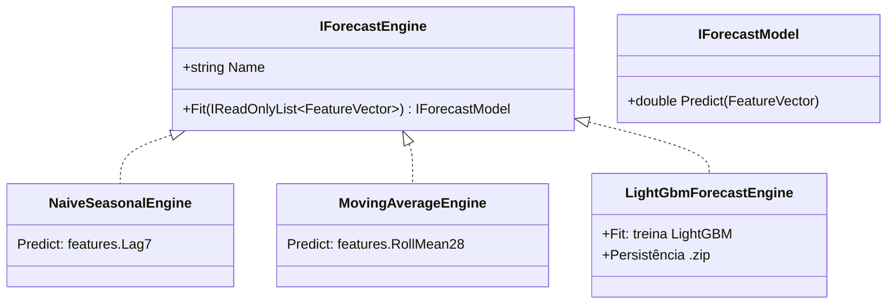
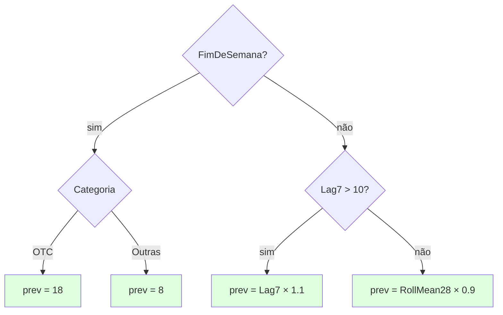

# 03 — Engines de Previsão

> Fases **F6.1** e **F6.2** do roadmap · projeto [CosmosPro.ML.DemandForCast.Forecasting](../CosmosPro.ML.DemandForCast.Forecasting/)

## O quê

Três algoritmos que recebem um `FeatureVector` ([doc 02](02-feature-engineering.md)) e devolvem uma **previsão pontual** (um número: quantas unidades de SKU X serão vendidas na loja Y no dia D).

| Engine | Tipo | Aprende? | Implementação |
|---|---|---|---|
| **Naïve Sazonal** | baseline | não | retorna `Lag7` |
| **Média Móvel** | baseline | não | retorna `RollMean28` |
| **LightGBM** | ML | sim (gradient boosted trees) | pipeline ML.NET |

Todos implementam a mesma interface `IForecastEngine` — **plugáveis e comparáveis**.



## Por quê três engines?

> **"Se o modelo de ML não vencer o naïve, ele não vale a complexidade."**

É a **regra-ouro** de previsão de demanda. ML caro (LightGBM treina, salva, exige features) só justifica se entregar erro **significativamente menor** que algo trivial.

- **Naïve sazonal** é o "vergonhoso de não vencer". Captura o sinal mais óbvio em farma: "amanhã será parecido com semana passada no mesmo dia da semana".
- **Média móvel** é o baseline "estável". Captura o nível, não a sazonalidade.
- **LightGBM** é o **engine de produção** — onde aposta-se que o ML faz diferença.

A comparação em walk-forward ([doc 04](04-avaliacao-metricas.md#walk-forward)) é o que dá honestidade ao TCC.

---

## Engine 1: Naïve Sazonal

```csharp
public double Predict(FeatureVector features) => (double)features.Lag7;
```

### Por que faz sentido

Em farma, **sazonalidade semanal é o sinal mais forte na maioria dos SKUs**: o consumo de quinta passada é um bom palpite para a quinta de hoje. O lag de 7 dias respeita o lead time (não vaza informação proibida) e é a previsão mais simples possível.

### Fórmula

$$
\hat{y}_D = y_{D-7}
$$

### Quando vence

- Em SKUs muito **regulares** (vendem todo dia com pouca variância).
- Em períodos **sem disrupção** (sem promoção, sem feriado próximo, sem ruptura).

### Quando perde

- Em SKUs **intermitentes** (vendem 1 unidade a cada 2 semanas). Lag7 quase sempre será 0.
- Em períodos com **mudanças de regime** (chegou verão, queda em respiratórios).
- Quando o dia-alvo é **feriado** ou tem **promoção** que o lag7 não viu.

### Resultado no nosso dataset

| Engine | WAPE global |
|---|---|
| **Naïve Sazonal** | **60,7%** |
| Média Móvel | 47,3% |
| LightGBM | 29,4% |

O naïve sozinho explica 60% de "erro relativo" — o LightGBM cortou esse erro pela metade.

---

## Engine 2: Média Móvel {#media-movel}

```csharp
public double Predict(FeatureVector features) => (double)features.RollMean28;
```

### Por que faz sentido

Em SKUs **irregulares**, onde Lag7 sozinho é instável (e.g., o SKU vende em um dia da semana específico, e Lag7 pega justamente um zero), a média móvel de 28 dias **suaviza ruído** e dá um nível confiável.

### Fórmula

$$
\hat{y}_D = \frac{1}{N} \sum_{k=\text{lead}}^{\text{lead}+N-1} y_{D-k}
$$

Com $N = 28$ e lead time = 7, soma vendas de D−7 a D−34.

### Quando vence

- SKUs **intermitentes** ou **sazonalidade pouco marcada**.
- Como **âncora de nível** — se o LightGBM falha, MA-28 ainda dá uma resposta decente.

### Limitação

Não captura sazonalidade. Domingo e quarta-feira recebem a mesma previsão; pode ser muito conservador (alisa picos legítimos de fim-de-semana, etc.).

---

## Engine 3: LightGBM {#lightgbm}

### O que é, em uma frase

**LightGBM** é uma implementação eficiente de **Gradient Boosted Decision Trees (GBDT)** — um ensemble de árvores de decisão construídas sequencialmente, onde cada nova árvore corrige os erros das anteriores.

Microsoft Research publicou em 2017 ([paper](https://papers.nips.cc/paper/2017/hash/6449f44a102fde848669bdd9eb6b76fa-Abstract.html)). É **o** trabalho-cavalo na maior parte dos sistemas de previsão de demanda em produção hoje (M5 Competition foi dominada por GBDTs em 2020).

### Por baixo do capô

Um **decision tree** simples para previsão de demanda de um SKU poderia ser:



Cada **nó** é uma pergunta sobre uma feature; cada **folha** é uma previsão. Uma única árvore raramente é precisa. **Boosting** treina muitas árvores em sequência: a árvore #2 mira nos **erros** da #1, a #3 nos erros da #1+#2, etc.

$$
\hat{y}_D = \sum_{t=1}^{T} \eta \cdot \text{arvore}_t(\text{features}_D)
$$

com $\eta$ = learning rate (≈ 0,1), $T$ = número de iterações (≈ 100). A soma das árvores ponderadas é a previsão final.

### Por que LightGBM é "leve e rápida"

- **Histogram-based splits**: agrupa valores contínuos em bins para acelerar a busca pelo melhor corte.
- **Leaf-wise growth** (em vez de level-wise): a árvore cresce primeiro pelas folhas que dão mais ganho — mais profunda em regiões úteis, mais rasa em regiões irrelevantes.
- **Bom suporte a features categóricas com alta cardinalidade** (SKU com centenas de valores).

### Hiperparâmetros usados

[`LightGbmHyperparameters`](../CosmosPro.ML.DemandForCast.Forecasting/Engines/LightGbmForecastEngine.cs):

| Param | Default | O que faz |
|---|---|---|
| `NumberOfLeaves` | 31 | Tamanho máximo de cada árvore. Mais folhas = mais flexível (overfit risk) |
| `NumberOfIterations` | 100 | Quantas árvores no ensemble. Mais = mais aprendizado, mais lento |
| `LearningRate` | 0,1 | Quão "agressivamente" cada árvore corrige a anterior |
| `MinimumExampleCountPerLeaf` | 20 | Folha precisa de ≥20 amostras para existir (regularização) |
| `Seed` | 42 | Reprodutibilidade |

### Pipeline ML.NET


#### Por que `OneHotEncoding` nas categóricas?

ML.NET não aceita strings diretamente em modelos numéricos. Para cada coluna categórica (`Sku`, `Categoria`, `UF`, ...), o `OneHotEncoding` cria **uma coluna binária por valor único** (e.g., `Sku == "SKU00042" → 1`, todas as outras 499 colunas → 0).

Para 500 SKUs, gera 500 colunas binárias. LightGBM lida bem com esparsidade.

#### Por que `Concatenate("Features", ...)`?

ML.NET exige uma única coluna vetor chamada `Features` (convenção). O `Concatenate` empilha numéricas e one-hot em um único vetor de ~520 dimensões.

### Persistência

LightGBM treinado é serializado como `.zip` pelo `mlContext.Model.Save(model, schema, path)`. O arquivo contém:
- Pipeline completo (one-hot mappings, transformações).
- Árvores do ensemble (estrutura + valores).
- Schema esperado de input.

`Model.Load` reconstrói tudo. **Roundtrip save/load preserva previsões idênticas** — testado no [`LightGbmForecastEngineTests`](../tests/CosmosPro.ML.DemandForCast.Forecasting.Tests/LightGbmForecastEngineTests.cs).

```csharp
[Fact]
public void Save_e_Load_preservam_as_previsoes() { ... }
```

### Determinismo: por que não testamos igualdade entre treinos

LightGBM com multithread (default) **não é bit-determinístico** mesmo com seed fixo — a ordem de soma de gradientes flutua. Para o TCC isso é OK: comparações estatísticas (WAPE de X% vs Y%) são estáveis; bit-exact não é o objetivo.

Os testes asseguram:
1. **Treina/prevê plausível** (não retorna negativos absurdos).
2. **Supera previsão pela média global** com folga (erro < 70% do erro do dummy).
3. **Roundtrip save/load** é exato.

---

## Padrão de uso conjunto

Os três engines vivem juntos no fluxo de treino ([doc 05](05-pipeline-treino-completo.md)):

```csharp
var engines = new IForecastEngine[] {
    new NaiveSeasonalEngine(),
    new MovingAverageEngine(),
    new LightGbmForecastEngine(),
};
foreach (var engine in engines) {
    var result = backtest.Run(engine, features);
    engineResults.Add(result);
}
```

Cada um produz o seu `BacktestResult` (métricas globais + por dimensão). A UI consolida os três lado a lado (próxima imagem em [doc 04](04-avaliacao-metricas.md)).

---

## Trade-offs e leituras

### O que não usamos (deliberadamente)

- **Redes neurais (DeepAR, N-BEATS, Transformer):** caro de treinar, hard de explicar, e **inferior a GBDTs em séries de varejo na M5** (resultado da competição). O TCC pode citar isso como justificativa.
- **ARIMA / ETS:** clássicos univariados; ignoram exógenas (promoção, preço, IQVIA). Bons como baseline acadêmico; aqui são vencidos pelo LightGBM sem esforço.
- **Croston / TSB:** específicos para demanda **intermitente** (muitas zeros). Podem ser úteis para SKUs classe C; deixados para fora do escopo do POC (~30 linhas de C# implementam Croston se necessário).
- **Modelos probabilísticos (quantile regression):** prever apenas a média perde a informação de incerteza, que importa muito para safety stock. Pode entrar em F8 se necessário.

### Onde conecta com o TCC

Argumente que **a escolha de LightGBM é metodologicamente alinhada com o estado-da-arte**: vencedor da M5, padrão na indústria, e a comparação contra baselines simples (naïve, MA) torna a evolução visível. Ao mesmo tempo, **mantém-se interpretável o suficiente** (decision trees são auditáveis) — coisa que redes neurais perdem.

### Referências para citar

- **LightGBM:** Ke, G. et al. (2017). "LightGBM: A Highly Efficient Gradient Boosting Decision Tree". *NeurIPS*. [Paper](https://papers.nips.cc/paper/2017/hash/6449f44a102fde848669bdd9eb6b76fa-Abstract.html).
- **Gradient Boosting (Friedman, 2001):** Friedman, J. H. (2001). "Greedy function approximation: A gradient boosting machine". *Annals of Statistics*, 29(5), 1189–1232.
- **M5 Forecasting Competition:** Makridakis, S., Spiliotis, E., & Assimakopoulos, V. (2022). "The M5 competition: Background, organization, and implementation". *International Journal of Forecasting*, 38(4).
- **Comparativo GBDT × deep learning em retail:** Bojer, C. S., & Meldgaard, J. P. (2021). "Kaggle forecasting competitions: An overlooked learning opportunity". *International Journal of Forecasting*, 37(2).
- **Princípio do baseline (CLAUDE.md §6 ecoa):** Brownlee, J. (2018). *Deep Learning for Time Series Forecasting*. Cap. "How to Develop a Baseline Forecast" — argumenta que **nenhuma técnica deve ser proposta sem comparação contra naïve**.

## Próxima leitura

→ [04 — Avaliação e métricas](04-avaliacao-metricas.md): como medir se um engine ganha do outro de forma honesta (walk-forward, métricas, drill-down).
