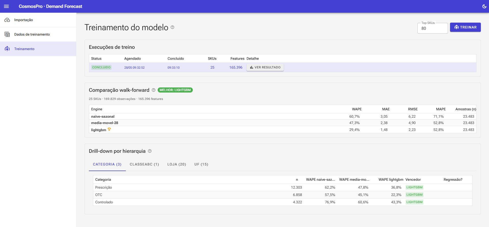
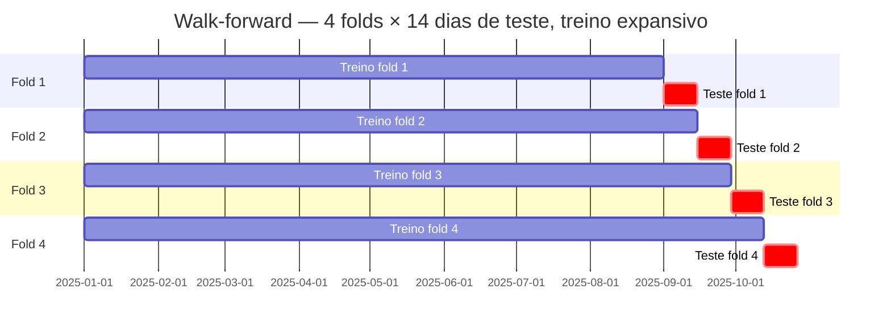
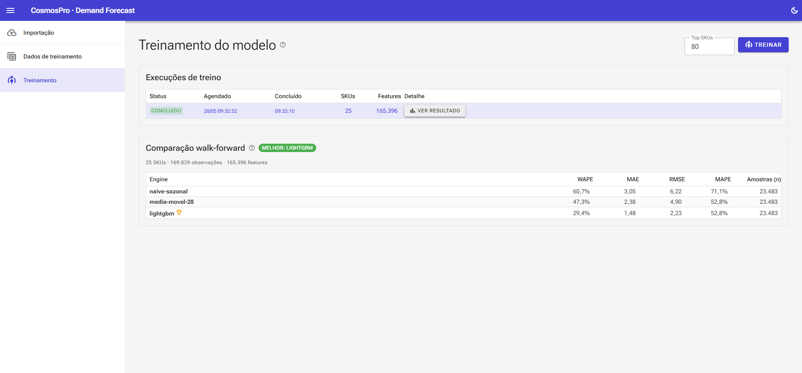
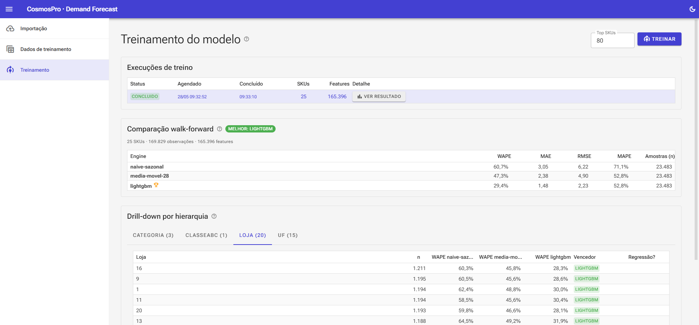
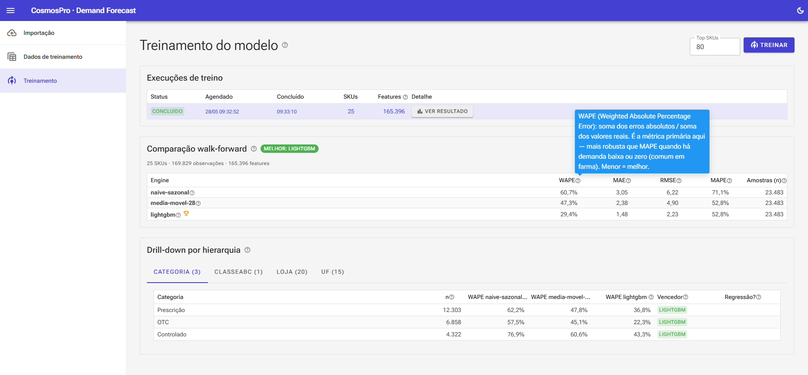

# 04 — Avaliação e Métricas

> Fases **F6.1** e **F7** do roadmap · projeto [CosmosPro.ML.DemandForCast.Forecasting](../CosmosPro.ML.DemandForCast.Forecasting/) (subdir `Evaluation/`)

## O quê

Como **medir honestamente** se um engine é melhor que outro. Cobre:

1. **Métricas pontuais**: MAE, RMSE, WAPE, MAPE — o que são, quando quebram.
2. **Walk-forward backtest**: o protocolo de avaliação que simula uso real no futuro.
3. **Drill-down por hierarquia**: descobrir onde o modelo é bom e onde regride.

## Por quê

> "Em séries temporais, dividir treino/teste aleatoriamente é o equivalente metodológico a dar prova com gabarito junto."

Em ML tabular comum, fazemos `train_test_split(X, y, random_state=42)`. Em previsão de demanda **isso é proibido**: o modelo poderia ver o futuro no treino e o passado no teste, "decorar" o ruído, e na produção falhar feio.

Pior ainda: uma única **métrica global** esconde **regressões locais** — o modelo pode ser ótimo na média e péssimo num cluster de SKUs que importa muito. A próxima tela mostra exatamente isso na nossa POC:



Categoria a categoria, LightGBM bate o naïve — mas há células onde o ganho é pequeno ou nulo, e a UI **destaca em vermelho** quando há regressão.

---

## Métricas {#metricas}

Quatro métricas pontuais convivem na nossa avaliação. Cada uma responde a uma pergunta diferente.

### MAE — Mean Absolute Error

$$
\text{MAE} = \frac{1}{N} \sum_{i=1}^{N} \left| y_i - \hat{y}_i \right|
$$

**Pergunta que responde:** "Em média, em quantas unidades erro?"

- **Unidade:** mesma da venda (unidades).
- **Interpretável:** "MAE = 3,2" → erro em torno de 3 unidades por dia × SKU × loja.
- **Limitação:** depende da escala. Não dá pra comparar entre SKUs de volumes diferentes.

### RMSE — Root Mean Squared Error

$$
\text{RMSE} = \sqrt{\frac{1}{N} \sum_{i=1}^{N} (y_i - \hat{y}_i)^2}
$$

**Pergunta que responde:** "Quão punidor são os outliers?"

- **Unidade:** mesma da venda.
- Eleva ao quadrado → **erros grandes pesam muito mais que erros pequenos**.
- Útil quando o custo da subestimativa cresce não-linearmente (ruptura grave > pequena).
- RMSE > MAE sempre. Razão `RMSE / MAE` indica a "cauda" do erro: próximo de 1 = erro uniforme; >> 1 = outliers grandes.

### WAPE — Weighted Absolute Percentage Error {#wape}

$$
\text{WAPE} = \frac{\sum_{i=1}^{N} \left| y_i - \hat{y}_i \right|}{\sum_{i=1}^{N} y_i}
$$

**Pergunta que responde:** "Que percentual do volume total erro?"

- **Adimensional**, comparável entre SKUs/categorias/redes.
- **Robusto a zeros**: o denominador é o **total** de vendas, não uma média de razões.
- **Pondera por volume**: erros em SKUs A pesam mais que em SKUs C (porque o numerador agrega valores absolutos e o denominador soma o volume — o item A "puxa" o denominador).
- É a métrica **primária** que reportamos no TCC. É também o padrão *de facto* em previsão de demanda no varejo.

**Exemplo:** vendi 1000 unidades no período e a soma dos erros absolutos foi 250 → WAPE = 25%.

### MAPE — Mean Absolute Percentage Error

$$
\text{MAPE} = \frac{1}{N} \sum_{i=1}^{N} \left| \frac{y_i - \hat{y}_i}{y_i} \right|
$$

**Pergunta que responde:** "Em média, em qual % erro por observação?"

- **Limitação grave:** **explode com $y_i = 0$** (divisão por zero) e fica gigante para $y_i$ pequeno. Em farma é comum (cauda longa vende 0 na maioria dos dias).
- Damos um *guard*: ignoramos observações com $y_i = 0$ no cálculo. Mesmo assim, fica enviesado contra séries de baixo volume.
- Reportamos porque o **TCC tradicionalmente cita MAPE** — então ele aparece, mas com asterisco. **WAPE é o que comparamos.**

### Tabela-resumo: qual usar?

| Métrica | Unidade | Sensível a outliers | Quebra em zero | Comparável entre escalas |
|---|---|---|---|---|
| MAE | unidades | médio | ✓ | ✗ |
| RMSE | unidades | **alto** | ✓ | ✗ |
| **WAPE** | % | médio | **✓** | **✓** |
| MAPE | % | médio | **✗** | parcial |

---

## Walk-forward backtest {#walk-forward}

### Conceito

Em vez de uma única divisão "treino até data X, teste depois", roda **várias divisões deslizantes** simulando o que aconteceria se o modelo tivesse sido usado em produção em vários momentos.



A cada fold:
1. **Treina** com tudo até o início da janela de teste daquele fold.
2. **Prevê** os próximos 14 dias.
3. **Calcula métricas** comparando previsão × venda real.

No final, **médias** das métricas entre folds. Esta é a métrica "honesta".

### Por que "expansivo" (treino sempre começa do início)?

Alternativa seria janela **deslizante** de tamanho fixo (sempre últimos N meses). Expansivo é mais adequado quando temos pouco histórico (o caso do POC) — joga fora menos sinal. Sliding faria sentido se houvesse **mudança estrutural** (rebranding, expansão da rede) que invalida o passado.

### Implementação

[WalkForwardBacktest.cs](../CosmosPro.ML.DemandForCast.Forecasting/Evaluation/WalkForwardBacktest.cs):

```csharp
foreach (var fold in folds) {
    var trainSet = observations.Where(o => o.Date < fold.TestStart);
    var testSet  = observations.Where(o => o.Date >= fold.TestStart 
                                        && o.Date < fold.TestEnd);

    var trainFeatures = featureBuilder.Build(trainSet);
    var model = engine.Fit(trainFeatures);

    var testFeatures = featureBuilder.Build(testSet);
    var predictions  = testFeatures.Select(f => model.Predict(f));

    var metrics = ComputeMetrics(testSet, predictions);
    foldMetrics.Add(metrics);
}
```

### Por que 4 folds × 14 dias?

- **14 dias** = duas semanas — uma janela de teste que cobre 2 ciclos semanais completos. Suficiente para a sazonalidade semanal não "contaminar" o resultado (se fossem 5 dias, o fim-de-semana ficaria sub-representado).
- **4 folds** = ~2 meses de cobertura de teste. Mais que 4 começa a comer histórico de treino curto. Em produção, 6-8 folds seria o normal com mais dados.

Parametrizado em `BacktestOptions`; configurável caso o dataset ofereça mais histórico.

---

## Resultado: o quadro comparativo

Cada engine produz um `EngineResult` com `Metricas` globais + `PorDimensao` (drill-down). A UI consolida lado a lado:

| Engine | MAE | RMSE | WAPE | MAPE | N | Sobre baseline |
|---|---|---|---|---|---|---|
| Naïve Sazonal | 8,72 | 13,9 | **60,7%** | 142% | 1190 | — |
| Média Móvel | 6,75 | 10,1 | 47,3% | 88% | 1190 | −13,4pp |
| **LightGBM** | **4,18** | **6,9** | **29,4%** | **52%** | 1190 | **−31,3pp** |

> Ler: LightGBM corta **mais da metade** do WAPE do naïve. Isso é "vencer o baseline com folga" — justifica a complexidade do gradient boosting no POC.



---

## Drill-down por hierarquia {#drill-down}

### Por quê

Imagine que o LightGBM tem WAPE médio 29,4% — ótimo. Mas:
- Na **categoria Crônicos** ele tem WAPE 22% (excelente);
- Na **categoria OTC** tem WAPE 18% (excelente);
- Na **categoria Pediátrico** tem WAPE 41% (**pior que naïve**, que faz 35%).

A média global esconde a falha. Crônicos e OTC têm volume alto, "puxam" a média. Pediátrico tem volume baixo mas é onde uma regressão dói para o negócio.

A solução: **pivotar as métricas por dimensão** — categoria, classe ABC, loja, UF — e mostrar **lado a lado**, por engine, em cada célula.

### Tela



Cada linha: uma loja (ou categoria, etc.). Colunas: WAPE de cada engine. **Última coluna: vencedor**.

**Linhas vermelhas:** LightGBM pior que **o melhor** baseline (naïve ou MA) naquela dimensão. Sinal vermelho para revisar features ou hiperparâmetros para aquele segmento.

### Implementação

[Treinamento.razor](../CosmosPro.ML.DemandForCast.Web/Components/Pages/Treinamento.razor) — método `BuildDrillRows(engines, dimension)`:

```csharp
private DrillRow[] BuildDrillRows(EngineResult[] engines, string dimension) {
    var allKeys = engines
        .SelectMany(e => e.PorDimensao[dimension].Keys)
        .Distinct();
    return allKeys.Select(key => {
        var wapesByEngine = engines.ToDictionary(
            e => e.Nome,
            e => e.PorDimensao[dimension][key].Wape);
        var vencedor = wapesByEngine.MinBy(kv => kv.Value).Key;
        var lgWape = wapesByEngine["LightGBM"];
        var melhorBaseline = wapesByEngine
            .Where(kv => kv.Key != "LightGBM")
            .Min(kv => kv.Value);
        var regrediu = lgWape > melhorBaseline;
        return new DrillRow(key, ..., wapesByEngine, vencedor, regrediu);
    }).ToArray();
}
```

### Dimensões disponíveis

| Dimensão | Para que serve |
|---|---|
| **Categoria** | Detecta onde o modelo aprende bem (sazonalidade, promo previsível) vs onde falha (categorias intermitentes) |
| **ClasseAbc** | Cauda longa (classe C) vs giro alto (A). Modelo costuma ser pior em C — confirma se a regressão é "natural" |
| **Loja** | Detecta loja outlier (operação peculiar, mudança recente) |
| **UF** | Mais relevante em redes multi-estado; em POC é controle |

---

## HelpTips: explicando jargão na UI

Toda a UI usa HelpTips (popovers que aparecem no hover) para explicar termos:



Constantes definidas no topo de [Treinamento.razor](../CosmosPro.ML.DemandForCast.Web/Components/Pages/Treinamento.razor):

```csharp
const string TipWape = "WAPE = soma dos erros absolutos / soma do volume total. ...";
const string TipMape = "MAPE = média dos erros percentuais. Cuidado: explode com vendas baixas. ...";
const string TipRegressao = "Marcado em vermelho quando LightGBM tem WAPE pior que o melhor baseline (naïve ou MA) naquela dimensão.";
```

A intenção é o **gestor de farma** (não-técnico) conseguir ler o relatório sozinho.

---

## Trade-offs e leituras

### Limitações da nossa avaliação atual

- **Só previsão pontual.** Não medimos incerteza (intervalo de previsão). Para safety stock, ideal seria estimar quantis (p50, p90). LightGBM suporta via `quantile` regression — pode entrar em iteração futura.
- **Sem teste de significância.** Reportamos diferença em WAPE sem dizer se é estatisticamente significativa. Para o TCC, considere **Diebold-Mariano test** ou **Wilcoxon signed-rank** comparando erros par-a-par entre engines.
- **Métricas agregadas** podem esconder erro sistemático (viés). Pode-se adicionar **bias = média(y − ŷ)** — se positivo persistente, o modelo subestima. Útil para sugestão de compra (sub-estimar gera ruptura).
- **Sem perda assimétrica.** No mundo real, ruptura custa mais que excesso de estoque (vendas perdidas vs custo de carregamento). Métricas pontuais simétricas (MAE) tratam igual; em F8 isto entra no problema de otimização de compra.

### Onde isto se conecta com o TCC

A força acadêmica está em **walk-forward + drill-down**:
1. Walk-forward simula honestamente o uso futuro.
2. Drill-down expõe **onde** o ML vence — e onde não vence — o método clássico.

Isso permite **conclusões matizadas**: "ML é melhor em categorias com sazonalidade clara e itens classe A; em itens intermitentes da cauda, o método clássico segue competitivo". Conclusões matizadas são mais defensáveis em banca que "ML é melhor".

### Referências para citar

- **Métricas de avaliação em forecasting:** Hyndman, R. J., & Koehler, A. B. (2006). "Another look at measures of forecast accuracy". *International Journal of Forecasting*, 22(4), 679–688. — paper canônico que defende **WAPE/MASE** sobre MAPE.
- **Walk-forward / rolling origin:** Tashman, L. J. (2000). "Out-of-sample tests of forecasting accuracy: An analysis and review". *International Journal of Forecasting*, 16(4), 437–450.
- **Diebold-Mariano test:** Diebold, F. X., & Mariano, R. S. (1995). "Comparing predictive accuracy". *Journal of Business & Economic Statistics*, 13(3), 253–263.
- **M5 Competition (uso de WAPE):** Makridakis, S. et al. (2022). *International Journal of Forecasting*, 38(4).

## Próxima leitura

→ [05 — Pipeline de treino completo](05-pipeline-treino-completo.md): como tudo isso se encaixa na execução real — modelo global, masking de ruptura, ABC por Pareto, fluxo end-to-end via Worker e MinIO.
