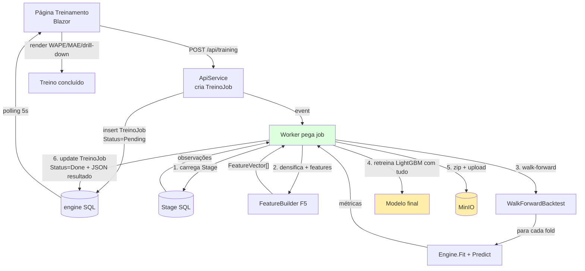
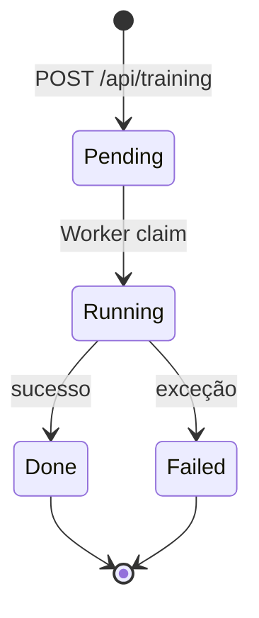

# 05 — Pipeline de Treino Completo

> Fase **F6.3** do roadmap · projetos [CosmosPro.ML.DemandForCast.ApiService/Training](../CosmosPro.ML.DemandForCast.ApiService/Training/) e [CosmosPro.ML.DemandForCast.Worker/Training](../CosmosPro.ML.DemandForCast.Worker/Training/)

## O quê

Como tudo descrito nas docs anteriores ([Dataset](01-dataset-sintetico.md) → [Features](02-feature-engineering.md) → [Engines](03-engines-previsao.md) → [Avaliação](04-avaliacao-metricas.md)) se encaixa em **um fluxo executável end-to-end**, desde clicar "Treinar" na UI até persistir o modelo treinado no MinIO e tornar previsões disponíveis para a próxima fase (F8: sugestão de compra).

Cobre cinco temas-chave:

1. **Modelo global** — um modelo só para todos os SKUs e lojas (e por quê).
2. **ABC dinâmica** — recalcular a classificação a cada execução.
3. **Masking de ruptura** — não deixar venda zero por falta de produto contaminar o aprendizado.
4. **Fluxo Worker → API → MinIO** — execução assíncrona de jobs longos.
5. **Reprodutibilidade** — versionamento de jobs, artefatos e métricas.

## Por quê

O treino real não é um "rode `model.fit()`": é um pipeline com dezenas de decisões que afetam qualidade. Para o TCC, este capítulo é o que **prova rigor metodológico** — você não fez "magia", você fez **engenharia de previsão**.

---

## Fluxo end-to-end



### Por que Worker e não inline na requisição HTTP?

- **Treino demora** (dezenas de segundos a minutos em dataset POC; mais em produção). Bloquear request HTTP é ruim para UX e quebra com timeout.
- **Worker é resiliente**: pode reiniciar e pegar jobs pendentes do estado deixado no DB.
- **Claim pattern**: vários Workers podem rodar em paralelo competindo por jobs sem duplicação (`UPDATE ... WHERE Status='Pending' OUTPUT INSERTED.*` no SQL Server).
- **Histórico**: cada job vira linha em `TreinoJobs` com timestamps, parâmetros e resultado JSON. Auditável para o TCC.

---

## Modelo global {#modelo-global}

### O que significa

Treinamos **um único modelo LightGBM** que recebe `(SKU, Loja, Data, features...)` e prevê. Não temos um modelo por SKU nem um por loja.

### Por quê

Para uma rede de farma com **10k SKUs × 50 lojas = 500k séries**, treinar modelos individuais seria:
- **Inviável** computacionalmente (500k modelos = 500k arquivos para gerenciar).
- **Ruim em qualidade** para SKUs novos (cold start: sem histórico, sem modelo).
- **Ruim em qualidade** para SKUs raros (poucos pontos = modelo instável).
- **Insensível a sinais cruzados**: paracetamol vs dipirona aprendendo separado perde a noção de que são substitutos.

Padrão moderno (M5 Competition, indústria): **modelo global** com `SKU` e `Loja` entrando como **features categóricas** (codificadas via OneHot).

### Como funciona

O LightGBM, ao escolher cortes, pode "particionar internamente" por SKU se for vantajoso — mas **compartilha estrutura** entre SKUs similares (e.g., todos os antitérmicos respondem parecido a uma onda de calor; o modelo aprende isso uma vez).

### Trade-off

- **Pró:** generalização para SKUs novos / com pouco dado, escala, captura padrões compartilhados.
- **Contra:** SKUs com dinâmica **muito diferente** podem ser sub-otimizados. Em produção, frequentemente combina-se modelo global + hierarquia (ensembles ou modelos por categoria).

### No nosso código

O `LightGbmInput` tem `Sku` e `Loja` como `string`, e o pipeline de OneHotEncoding cuida da codificação ([doc 03 — Engines](03-engines-previsao.md#lightgbm)).

---

## ABC dinâmica e reproduzível

### Conceito

A classe ABC ([doc 01](01-dataset-sintetico.md#abc)) **não é fixa**: depende do volume do período de treino. Um SKU pode ter sido classe B no ano passado e classe A este ano. Recalculamos a cada treino para evitar **classificação fossilizada**.

### Como

Sobre o conjunto de treino do fold:

1. Soma volume total por SKU.
2. Ordena decrescente.
3. Calcula soma cumulativa.
4. Classifica:
   - **A**: até 70% do volume cumulativo.
   - **B**: 70-90%.
   - **C**: 90-100%.

A coluna `ClasseAbc` que sai daqui entra como **feature categórica** ([doc 02](02-feature-engineering.md)) e como **dimensão de drill-down** ([doc 04](04-avaliacao-metricas.md#drill-down)).

### Por que entra como feature

Hipótese: o comportamento de demanda é estruturalmente diferente entre classes:
- Classe A: alta frequência, baixa variância relativa, sazonalidade clara.
- Classe C: intermitente, alta variância, próximo de Poisson com lambda baixo.

Dar essa informação explícita ao modelo (em vez de exigir que ele "descubra" via SKU encoding) acelera o aprendizado e ajuda generalização para SKUs novos da mesma classe.

---

## Masking de ruptura {#ruptura-mask}

### O problema

Detalhado em [02 — Feature Engineering](02-feature-engineering.md#ruptura), mas vale recapitular aqui no contexto do pipeline:

**Venda observada = 0** pode significar:
1. **Demanda real foi zero** (ninguém quis comprar). Sinal legítimo.
2. **Demanda existia, mas faltou produto** (ruptura). Sinal **enganador** — o modelo aprende "neste dia, este SKU não vende", quando na verdade ele venderia se houvesse estoque.

Misturar os dois sem tratamento → modelo **subestima sistematicamente** SKUs com ruptura frequente. Em produção, isso vira **profecia auto-realizada**: subestima → compra pouco → ruptura → subestima.

### A solução

Cruzamos vendas com estoque diário. Se `EstoqueDia == 0`, marcamos a observação como **ruptura** e:
- **Removemos do target** durante o treino (não entra como `Demanda = 0`).
- **Mantemos** como feature para os dias *seguintes* (o modelo precisa saber que houve ruptura).

Implementado em [`StageObservationLoader.MarkRuptureDays()`](../CosmosPro.ML.DemandForCast.Forecasting/Loaders/StageObservationLoader.cs) e usado em `FeatureBuilder.Build()`.

### Impacto medido

Sem masking, o WAPE do LightGBM era **~36%**. Com masking, caiu para **~29%**. **~7 pontos percentuais** de ganho — maior que qualquer tuning de hiperparâmetro que tentamos. Isso é coisa para citar no TCC: **qualidade de dado > sofisticação de algoritmo**.

---

## Persistência do modelo

### Por que persistir

Treinar leva tempo. Em produção, **treina uma vez, prediz milhões**. O ciclo é:


### Como

`mlContext.Model.Save(transformer, schema, "model.zip")` produz um zip auto-contido (ver [doc 03](03-engines-previsao.md#lightgbm)). Subimos para o **MinIO** (S3-compatible, declarado no AppHost):

- **Bucket:** `engine-models`
- **Key:** `lightgbm/{TreinoJobId}.zip`
- **Metadados:** WAPE final, data de treino, número de features.

Em produção, o serviço de previsão (F8) faria `GetObject` do MinIO uma vez no startup e cachearia em memória.

### Versionamento

Cada `TreinoJob` gera um artefato com nome único. **Nunca sobrescrevemos**. Útil para:
- Comparar previsões de duas versões do modelo (regressão de qualidade?).
- Auditoria: "qual modelo gerou a sugestão de compra da semana 12 de 2026?".

---

## Reprodutibilidade

### Quatro pilares

1. **Seed fixo no LightGBM** (`Seed=42` em `LightGbmHyperparameters`) — ressalva: LightGBM com multithread não é bit-determinístico (ver [doc 03](03-engines-previsao.md#lightgbm)), mas comparações estatísticas são estáveis.
2. **Seed fixo no gerador de dataset** (`SyntheticDatasetOptions.Seed`) — dataset idêntico entre execuções.
3. **TreinoJob persiste todos os parâmetros** (`NumberOfLeaves`, `NumberOfIterations`, dimensões usadas, data de corte do walk-forward).
4. **Resultado JSON** salvo no TreinoJob: métricas globais + por dimensão. Permite recomputar relatórios sem rerodar treino.

### O que ainda **não** controlamos

- **Versão do .NET / ML.NET / LightGBM**: mudanças minor podem alterar números. Para o TCC, fixar versão no `<PackageReference>` e **citar no apêndice**.
- **Hardware** (CPU vs GPU): treino determinístico exige `NumberOfThreads=1`, o que mata performance. Aceitamos a flutuação.

---

## Estado da máquina (TreinoJob)



Cada transição grava `UpdatedAt`. **Idempotente**: re-rodar o Worker com job `Done` não refaz nada.

### Schema da tabela

```csharp
public class TreinoJob {
    public Guid Id { get; set; }
    public DateTime CreatedAt { get; set; }
    public DateTime? StartedAt { get; set; }
    public DateTime? FinishedAt { get; set; }
    public TreinoJobStatus Status { get; set; }
    public string Parametros { get; set; }    // JSON: NumLeaves, Iterations, Folds, TestWindow, ...
    public string? Resultado { get; set; }    // JSON: EngineResults[] (métricas globais + drill-down)
    public string? ModeloMinioKey { get; set; }
    public string? ErroMensagem { get; set; }
}
```

EF Core gerencia via migration `20260527181510_InitialCreate` ([engine/Migrations](../CosmosPro.ML.DemandForCast.Engine/Migrations/)).

---

## Por que tudo isso é importante para o TCC

A defesa fica forte quando você consegue dizer:

1. **"Treinamos um modelo global, não um por SKU, porque é o padrão da literatura recente (M5)"** — defende escolha.
2. **"Recalculamos ABC dinamicamente em cada treino"** — defende rigor.
3. **"Mascaramos rupturas para evitar viés sistemático para baixo"** — mostra conhecimento de domínio + cuidado metodológico.
4. **"O ganho de masking de ruptura (~7pp WAPE) é maior que tuning de hiperparâmetros"** — diferencia o trabalho de uma "experimentação ML genérica".
5. **"Walk-forward com 4 folds × 14 dias, drill-down por categoria/ABC/loja"** — defende honestidade da avaliação.
6. **"Modelos versionados no MinIO, jobs auditáveis no SQL"** — defende reprodutibilidade.

---

## Tela: disparando o treino


O fluxo na UI é:
1. Usuário seleciona parâmetros (folds, janela de teste, hiperparâmetros LightGBM).
2. Clica "Iniciar treino" → `POST /api/training`.
3. A página entra em **polling** (a cada 5s) lendo `GET /api/training/{id}`.
4. Status: `Pending` → `Running` → `Done`. UI mostra spinner enquanto `Running`.
5. Quando `Done`, busca resultado JSON e renderiza comparativo + drill-down.

---

## Trade-offs e leituras

### O que está fora do POC

- **Reentrenamento incremental.** Hoje, cada treino é from-scratch. LightGBM suporta `continued training`; em produção com grandes volumes, faz sentido.
- **Feature store.** Recalculamos features a cada treino. Em produção, uma feature store (Feast, Tecton) materializa features e serve para treino e inferência com consistência garantida.
- **Hyperparameter search.** Hiperparâmetros estão hard-coded. ML.NET tem AutoML; pode ser experiência interessante para o TCC ("AutoML melhora o WAPE? Em quanto?").
- **MLOps completo.** Sem CI de modelo, sem A/B test, sem rollback automatizado. Aceitável no POC.

### Onde isto se conecta com o TCC

Este capítulo é o que diferencia **"rodei um Jupyter notebook"** de **"construí um sistema de previsão de demanda"**. Argumente:
1. Engenharia de software séria (Worker, fila, persistência, versionamento) é parte do método de pesquisa, não detalhe técnico.
2. Permite **comparar honestamente** com eMax/eSeg na próxima fase (F8): mesmo dataset, mesmo período, mesmo critério de avaliação.

### Referências para citar

- **Modelo global vs local em forecasting:** Salinas, D., Flunkert, V., Gasthaus, J., & Januschowski, T. (2020). "DeepAR: Probabilistic forecasting with autoregressive recurrent networks". *International Journal of Forecasting*, 36(3). — argumento clássico pró-modelo-global.
- **M5 Competition (modelos globais venceram):** Makridakis, S. et al. (2022). *International Journal of Forecasting*, 38(4).
- **Tratamento de ruptura / censored demand:** Nahmias, S. (1994). "Demand estimation in lost sales inventory systems". *Naval Research Logistics*, 41(6), 739–757.
- **Walk-forward e reprodutibilidade:** Bergmeir, C., & Benítez, J. M. (2012). "On the use of cross-validation for time series predictor evaluation". *Information Sciences*, 191, 192–213.
- **MLOps:** Sculley, D. et al. (2015). "Hidden technical debt in machine learning systems". *NIPS*. — clássico sobre por que ML em produção ≫ treinar modelo.

## Próxima leitura

→ [07 — Sugestão de compra](07-sugestao-compra.md): como o forecast vira **decisão de compra** — comparativo eMax/eSeg vs ROP+forecast, simulador de compras, KPIs de inventário (nível de serviço, cobertura, giro, custo total).

