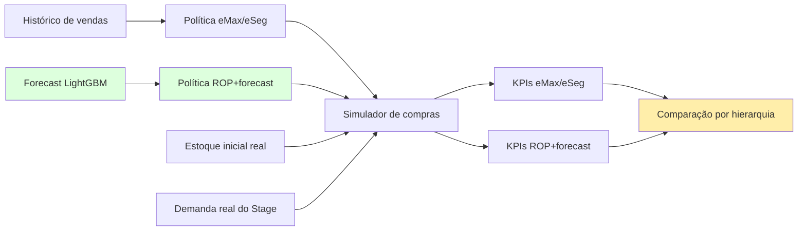
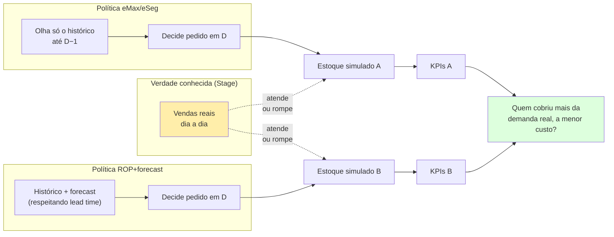
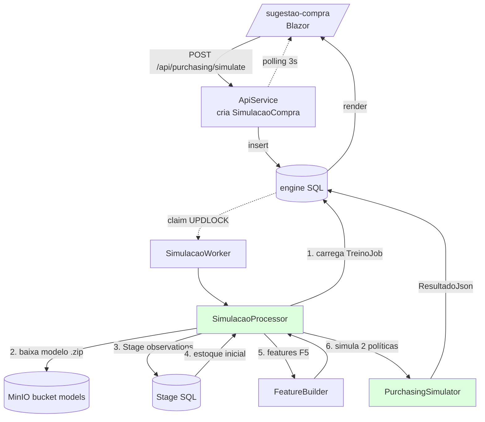

# 07 — Sugestão de Compra: eMax/eSeg vs ROP+Forecast

> Fase **F8** do roadmap · projeto [CosmosPro.ML.DemandForCast.Purchasing](../CosmosPro.ML.DemandForCast.Purchasing/) · UI em `/sugestao-compra`

## O quê

A pergunta-fim do TCC: **comprar segundo o forecast de ML é melhor que comprar segundo a regra eMax/eSeg clássica do varejo farma?**

Esta fase **não prevê demanda** — F6/F7 já fizeram isso. Aqui transformamos previsão em **decisão de compra** (quanto pedir, quando pedir, para qual SKU×loja) e avaliamos os dois caminhos **no mesmo terreno**: mesma janela histórica, mesmo estoque inicial, mesma demanda real.



## Por quê

> "Previsão sem decisão é só um número bonito. O que sustenta o TCC é a **decisão melhor**, não a previsão melhor."

O que importa para o negócio:
- **nível de serviço** (cliente encontrou o medicamento?)
- **capital parado** em estoque (custo financeiro)
- **número de pedidos** (custo operacional)
- **venda perdida** (receita não realizada)

Um forecast com WAPE 29% é interessante. Um forecast que **derruba a venda perdida em 30% mantendo o mesmo nível de serviço** é um resultado de banca.

---

## Não estamos prevendo o futuro — estamos refazendo o passado {#como-sabemos-quem-venceu}

> **A dúvida mais comum:** "Se a sugestão de compra é uma *previsão*, no momento em que ela é feita ainda não sabemos se vai dar certo. Então como o sistema decide qual política 'venceu'?"

A resposta dissolve a confusão: **a simulação de F8 não prevê o futuro — ela refaz o passado.** É um *replay contrafactual* (um "e se?") sobre uma janela histórica **que já aconteceu**.

### O truque: o passado tem gabarito

Para os últimos N dias (default 60), o Stage **já sabe a verdade de campo**, dia a dia, por SKU×loja:

- quanto **realmente vendeu** (a demanda observada);
- se houve **ruptura** (e o estoque de cada dia);
- preço, promoção, etc.

Isso **não é previsão** — é o registro do que aconteceu. A "prova" e o "gabarito" estão ambos na mão.

### O que a simulação faz

Pega cada dia D da janela e pergunta: *"Se eu tivesse usado a política X naquele dia, sem saber o que viria pela frente, o que teria acontecido?"*

```
Para cada (SKU, loja, dia D), com cada política:
  1. Recebe os pedidos que chegariam hoje (lançados em D − lead time)
  2. Demanda real do dia D  ←  VEM DO STAGE (já é conhecida)
  3. Vende = mínimo(estoque, demanda real)
       → se demanda > estoque, o excedente é VENDA PERDIDA
  4. A política decide quanto pedir, enxergando APENAS o que conheceria em D:
       • histórico de vendas até D − 1
       • forecast do LightGBM para D+1 … D+LT+ciclo
         (que internamente só usa dados até D − lead time — o anti-leakage de F5)
       • estoque atual + pedidos em trânsito
  5. Lança o pedido → ele chegará em D + lead time
```

**O passo 4 é o que torna tudo honesto:** no dia D, nenhuma política — nem a clássica, nem a de ML — enxerga o "futuro real". É exatamente como teria sido em produção naquele dia. A previsão existe, mas é feita *às cegas* quanto ao que ainda não aconteceu.

### Por que isso responde "quem venceu"

Como conhecemos a **venda real**, ao fim dos N dias medimos, para cada política, contra o gabarito:

| Pergunta | KPI |
|---|---|
| Quanto da demanda **que de fato existiu** a política conseguiu atender? | Nível de serviço (unidades) |
| Em quantos dias **faltou** produto? | Nível de serviço (dias) |
| Quantas unidades de demanda real **ficaram sem atendimento**? | Venda perdida |
| Quanto capital **ficou parado** em estoque? | Cobertura / giro |
| Somando tudo, qual saiu **mais barata**? | Custo total |

"Venceu" = teve o melhor KPI segundo um critério fixo (no nosso caso, **custo total**). É uma medição **contra a realidade conhecida** — não contra outra previsão, nem contra um palpite sobre o futuro.



### A analogia que fecha a ideia

É como **dois técnicos de futebol reassistindo a um jogo que já terminou**, cada um anotando "eu teria escalado assim". Como o placar real é conhecido, dá para julgar qual escalação teria ido melhor — sem nenhum deles ter visto o resultado *antes* de decidir. F8 faz isso com 60 dias de compras, SKU por SKU.

O nome técnico é **backtest de política de inventário** (Silver/Pyke/Thomas; Law), o irmão do walk-forward de [F7](04-avaliacao-metricas.md#walk-forward): lá medimos a previsão pontual contra a venda real; aqui medimos a **decisão de compra** contra a venda real.

### O caveat honesto (precisa ir no TCC)

A "demanda real" é **observada pela venda**. Em dias de **ruptura**, a venda subestima a demanda (a pessoa quis comprar e não tinha). Nossa heurística — substituir esses dias pela média histórica não-ruptura do SKU×loja — é pragmática mas tem viés; ver [demanda real na ruptura](#demanda-real). Em produção, *censored demand estimation* (Nahmias, 1994) refina isso. É uma limitação a declarar, não a esconder.

---

## Os ingredientes

### 1. Política eMax/eSeg clássica {#emax-eseg}

A regra que farmácias usam (com variações) há décadas. Implementada em [EMaxESegPolicy.cs](../CosmosPro.ML.DemandForCast.Purchasing/Policies/EMaxESegPolicy.cs).

#### Fórmula

A partir dos últimos $N$ dias de venda (default 28) do SKU×loja:

$$
\mu = \text{média}(y_{D-N+1}, ..., y_{D-1}) \qquad
\sigma = \text{desvio padrão}(y_{D-N+1}, ..., y_{D-1})
$$

$$
\text{eSeg} = z \cdot \sigma \cdot \sqrt{LT}
$$

$$
s = \mu \cdot LT + \text{eSeg} \qquad
S = \mu \cdot (LT + \text{ciclo}) + \text{eSeg}
$$

- $z$: fator de serviço (1,65 ≈ 95% de chance de **não** romper estoque durante o lead time)
- $LT$: lead time (dias entre pedido e chegada)
- ciclo: dias que cada pedido deve cobrir além do lead time

#### Lógica de decisão (modelo (s, S))

- Se **posição de estoque** (físico + em trânsito) ≤ $s$ → pede `S − posição`.
- Caso contrário, não pede.

#### Por que essa regra existe (e por que ela é vulnerável)

- **Existe** porque é simples, robusta e não exige nada além da venda passada.
- **Vulnerável** porque **trata todos os dias iguais**: ignora sazonalidade semanal (sábado vende 50% mais), feriados, promoções planejadas, ondas de calor que disparam antitérmico, etc. Resultado típico: **excesso de estoque** quando a média histórica está superestimada e **ruptura** quando algum evento eleva a demanda além do passado recente.
- O $\sigma$ histórico mistura "ruído puro" com "variabilidade explicável" (sazonalidade, promo) — infla o safety stock desnecessariamente.

### 2. Política ROP + Forecast {#rop-forecast}

A política "ML" do TCC. Implementada em [ForecastRopPolicy.cs](../CosmosPro.ML.DemandForCast.Purchasing/Policies/ForecastRopPolicy.cs).

#### Fórmula

A partir do forecast LightGBM e dos resíduos recentes do mesmo modelo:

$$
d_{LT} = \sum_{i=1}^{LT} \hat{y}_{D+i} \qquad
d_{LT+\text{ciclo}} = \sum_{i=1}^{LT+\text{ciclo}} \hat{y}_{D+i}
$$

$$
\sigma_{\text{err}} = \text{desvio padrão}(\text{real}_t - \hat{y}_t),\ t \in [D-LT-N, D-LT)
$$

$$
\text{safety} = z \cdot \sigma_{\text{err}} \cdot \sqrt{LT}
$$

$$
s = d_{LT} + \text{safety} \qquad
S = d_{LT+\text{ciclo}} + \text{safety}
$$

Mesma lógica (s, S); o que muda é **de onde vêm $s$ e $S$**.

#### Por que isto pode vencer

1. **Demanda esperada dinâmica**: forecast de uma sexta-feira de feriado é diferente de forecast de uma terça-feira comum. eMax/eSeg trata as duas iguais.
2. **σ menor por construção**: se o modelo captura sazonalidade/promoção/calendário, o que sobra como erro é "ruído puro" — menor que o desvio bruto da demanda. Safety stock **encolhe sem perder nível de serviço**.
3. **Reage a promoção planejada**: a feature `EmPromocao` está no input do modelo. O forecast já sabe que vai haver promo. eMax/eSeg só descobre depois.

#### Por que pode perder

- **SKUs intermitentes / cauda longa** (classe C): o modelo prediz zero a maior parte do tempo; o resíduo é dominado por surpresas de venda raras. eMax/eSeg pode ser mais conservador e cobrir melhor.
- **Modelo ruim**: se WAPE > 70% (cenário ruim, fora do esperado para LightGBM bem afinado), o forecast injeta erro em vez de remover.
- **Mudança de regime**: se a rede recém-mudou de estratégia (novo perfil de loja, novo mix), o modelo treinado no passado erra; eMax/eSeg adapta-se mais rápido (média móvel curta).

---

### 3. Simulador de compras (replay) {#simulador}

[PurchasingSimulator.cs](../CosmosPro.ML.DemandForCast.Purchasing/Simulation/PurchasingSimulator.cs). Roda dia-a-dia, série-por-série, política-por-política.

#### Ordem de eventos em um dia D

```mermaid
flowchart TB
    A[Início do dia D] --> B[1. Recebe pedidos<br/>cujo dia de chegada = D]
    B --> C[2. Demanda real do dia<br/>vinda do Stage]
    C --> D[3. Atende: vendido = min(estoque, demanda)]
    D --> E[4. Venda perdida = demanda − vendido]
    E --> F[5. Política calcula s, S]
    F --> G{posição ≤ s?}
    G -->|sim| H[6. Pede S − posição<br/>chega em D + LT]
    G -->|não| I[6. Não pede]
    H --> J[7. Registra estoque do dia]
    I --> J
    J --> K[Próximo dia]
    style F fill:#dfd
```

#### Como obtemos "demanda real" {#demanda-real}

Crítico para a honestidade da simulação:

- **Vendas do Stage** são a venda **observada**. Em dias de ruptura, a venda é 0 mesmo que houvesse procura ([doc 02 ruptura](02-feature-engineering.md#ruptura)).
- Usar venda observada como demanda subestima sistematicamente.
- Mascarar inteiramente os dias de ruptura removeria a maior parte da janela em SKUs com ruptura frequente.

**Heurística pragmática do POC**: nos dias marcados como ruptura, substituímos a demanda pela **média histórica não-ruptura** do mesmo SKU×loja. Documentado no relatório do TCC como limitação metodológica.

#### Estoque inicial

[StageEstoqueInicialLoader.cs](../CosmosPro.ML.DemandForCast.Worker/Purchasing/StageEstoqueInicialLoader.cs) lê o último `QuantidadeEmEstoque` registrado em `EstoquesDiarios` antes da janela de simulação. É o **snapshot real** da rede no instante T₀ — não fingimos partir "cheios" (otimismo enviesado) nem "vazios" (pessimismo enviesado).

---

### 4. KPIs comparativos {#kpis}

Definidos em [SimulationResult.cs](../CosmosPro.ML.DemandForCast.Purchasing/Simulation/SimulationResult.cs). Calculados em agregado **global** e **por dimensão** (Categoria, ClasseAbc, Loja, UF).

| KPI | Fórmula | O que mede |
|---|---|---|
| **Nível de Serviço (unidades)** | $1 - \frac{\text{venda perdida}}{\text{demanda total}}$ | *Fill rate*. Pondera SKUs de alto giro. KPI primário do varejo. |
| **Nível de Serviço (dias)** | $1 - \frac{\text{dias com ruptura}}{\text{dias totais}}$ | *Cycle service level*. Insensível ao volume — captura ruptura crônica em itens raros. |
| **Venda perdida** | demanda − venda realizada | Unidades não atendidas. Vira queixa de cliente e receita não realizada. |
| **Cobertura média (dias)** | $\frac{\text{estoque médio}}{\text{demanda diária média}}$ | Dias de estoque parado. Inverso saudável do giro. |
| **Giro** | $\frac{\text{demanda total}}{\text{estoque médio}}$ | Turnover. Mais giro = capital trabalha mais. |
| **Pedidos** | nº de pedidos lançados | Custo operacional (cada pedido tem custo administrativo/logístico). |
| **Custo total** | $\alpha \cdot \sum \text{estoque-dia} + \beta \cdot \text{venda perdida}$ | KPI sintético: $\alpha$ = custo de carregar 1 unidade por 1 dia; $\beta$ = custo de cada unidade perdida. Parametrizados no POC. |

> O **custo total** é o que vai mais provavelmente entrar como métrica de banca. Em produção, $\alpha$ vem do financeiro (custo de capital + armazenagem); $\beta$ vem da operação (perda de margem + custo de cliente insatisfeito).

### Tela: comparativo

A página `/sugestao-compra` consolida tudo em duas partes — cabeçalho com KPIs globais por política e drill-down por hierarquia. Drill-down marca em verde a célula vencedora por custo total — é o "mapa de calor" da decisão.

---

## Como tudo se encaixa



### Por que o Worker, e não inline na API?

- Simulação leva segundos a minutos (depende de SKUs × dias da janela).
- O Worker já tem o padrão `(s, S)` da fila — mesmo claim, mesma idempotência, mesma persistência de resultado JSON.
- Histórico auditável: `SimulacaoCompra` guarda parâmetros, FK para `TreinoJob`, resultado completo.

### Por que linkar a uma TreinoJob específica

A política `ForecastRopPolicy` depende do **modelo treinado**: WAPE, sigma de erro, sazonalidade aprendida. **Qual modelo** mudou o resultado. Amarrar com FK garante reprodutibilidade — você pode rodar a mesma janela com dois modelos diferentes e comparar quanto da diferença vem do modelo, quanto vem da política.

---

## Decisões metodológicas (e suas limitações)

### O que está dentro do escopo

- **Replay determinístico**: mesmo input → mesmo output.
- **Mesmo estoque inicial real** para ambas as políticas — comparação justa.
- **Sigma do erro do forecast** (não do desvio da demanda bruta) — vantagem matemática da política ML quando o modelo é bom.
- **Drill-down por hierarquia** — captura assimetrias por classe ABC, categoria, loja.

### O que está fora (deliberadamente, para o POC)

- **Custos reais** (α, β): valores genéricos. Em produção, viriam do financeiro.
- **Lote mínimo / múltiplos de embalagem**: pedimos qualquer fração de unidade. Reais farma têm caixa fechada / múltiplo do master.
- **Janela de validade / FEFO**: medicamento controlado não pode ficar parado infinitamente. Não modelado.
- **Demanda real estimada na ruptura**: substituímos pela média histórica do SKU×loja (heurística). Métodos mais sofisticados (censored demand estimation, Nahmias) existem.
- **Múltiplos quantis**: política única (s, S). Não probabilística. Para safety stock probabilístico (p50/p80/p95) precisaríamos retreinar o LightGBM em modo quantile regression.
- **Pedidos consolidados loja×fornecedor**: cada SKU é pedido independentemente. Vida real consolida pedidos por fornecedor para ganhar frete.

### Como argumentar no TCC

A força acadêmica do experimento está em **três pilares**:
1. **Comparação no mesmo terreno**: mesmas séries, mesma janela, mesma demanda real, mesma simulação. Diferença de KPI = diferença de política, não viés experimental.
2. **Métricas em duas escalas** (unidades e dias): fill rate captura SKUs de alto giro; cycle service level captura SKUs de cauda longa. Ambos importam.
3. **Drill-down por classe ABC**: o ganho da política forecast-based **não é uniforme**. Em A é grande; em C pode ser zero ou negativo. Defender essa nuance é mais honesto que reportar média global.

---

## Referências para citar

- **Política (s, S) e modelos clássicos de inventário:** Silver, E. A., Pyke, D. F., & Thomas, D. J. (2016). *Inventory and Production Management in Supply Chains* — capítulos 6–8 cobrem revisão periódica, fator de serviço z, formulação eMax/eSeg.
- **Safety stock baseado em desvio do erro de previsão (e não da demanda):** Krupp, J. A. G. (1997). "Safety stock management". *Production and Inventory Management Journal*, 38(3) — defende usar σ do resíduo do forecast como base.
- **Demanda censurada (lost sales):** Nahmias, S. (1994). "Demand estimation in lost sales inventory systems". *Naval Research Logistics*, 41(6). Argumento metodológico para o tratamento de ruptura na simulação.
- **Forecast acoplado a decisão de compra:** Levi, R., Roundy, R. O., & Shmoys, D. B. (2007). "Provably near-optimal sampling-based algorithms for stochastic inventory control models". *Mathematics of Operations Research*, 32(4) — base teórica para conectar forecast probabilístico a política de reabastecimento.
- **Simulação como técnica de avaliação de políticas:** Law, A. M. (2015). *Simulation Modeling and Analysis*. McGraw-Hill — referência geral para defender o replay como protocolo.
- **Comparativos forecast vs regra clássica em retail:** Babai, M. Z., Boylan, J. E., & Rostami-Tabar, B. (2022). "Demand forecasting in supply chains: a review of aggregation and hierarchical approaches". *International Journal of Production Research*, 60(1).

## Próxima leitura

→ [06 — Glossário](06-glossario.md): definições rápidas dos termos de inventário (ROP, fill rate, safety stock, etc.) usados aqui.
