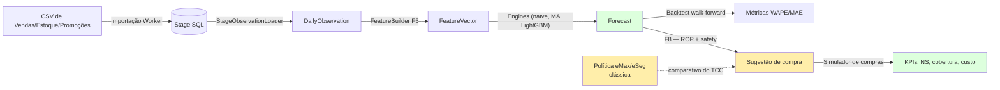
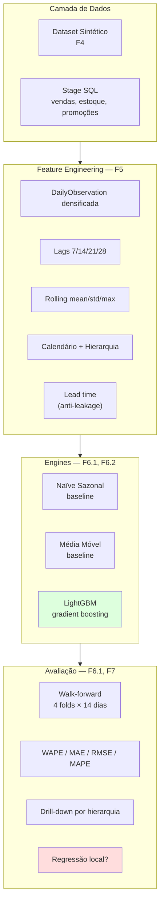

# Documentação técnica — Demand Forecast POC

> **Para quem é isto:** material acadêmico/didático que explica o **funcionamento conceitual** do POC do ponto de vista de Machine Learning e previsão de demanda. **Não cobre arquitetura de software** — para isso veja o [README do projeto](../README.md) e o [CLAUDE.md](../CLAUDE.md).
>
> **Premissa:** o leitor sabe varejo farma (eMax, eSeg, sugestão de compra) mas não necessariamente ML. Toda a explicação ancora no domínio quando possível.

---

## Índice

| Doc | Cobre | Fase do roadmap |
|-----|-------|------|
| [01 — Dataset sintético farma](01-dataset-sintetico.md) | Curva ABC, sazonalidade, promoções, ruptura, IQVIA, Poisson, geração reproduzível | **F4** |
| [02 — Feature Engineering](02-feature-engineering.md) | O que é "feature", lags, rolling, calendário, hierarquia, **anti-leakage por lead time** | **F5** |
| [03 — Engines de previsão](03-engines-previsao.md) | Baselines (naïve sazonal, média móvel) e **LightGBM** (gradient boosted trees) | **F6.1 / F6.2** |
| [04 — Avaliação e métricas](04-avaliacao-metricas.md) | MAE, RMSE, WAPE, MAPE; **walk-forward**; drill-down por hierarquia e regressões locais | **F6.1 / F7** |
| [05 — Pipeline de treino completo](05-pipeline-treino-completo.md) | Modelo global, ABC por Pareto, masking de ruptura, fluxo Worker → Stage → Features → LightGBM → MinIO | **F6.3** |
| [07 — Sugestão de compra](07-sugestao-compra.md) | Política eMax/eSeg vs ROP+forecast; simulador de compras; KPIs de inventário; comparativo central do TCC | **F8** |
| [06 — Glossário](06-glossario.md) | Termos-chave em ordem alfabética |

---

## Visão de 30 segundos

> Dado o histórico diário de vendas de uma rede de farmácias, prever a demanda dos próximos dias por SKU × loja, usando ML — para depois transformar isso em **sugestão de compra** mais precisa que a regra clássica (eMax/eSeg).

A grande pergunta do TCC é: **a sugestão de compra derivada do forecast ML (caminho de baixo, em verde) é melhor que a regra eMax/eSeg clássica (caminho lateral)?** O F8 responde via replay determinístico das duas políticas sobre o mesmo histórico — [doc 07](07-sugestao-compra.md) detalha.

---

## Mapa mental por camada

---

## Conceitos que você precisa internalizar (em ordem)

| # | Conceito | Por que importa | Onde está documentado |
|--:|---|---|---|
| 1 | **Série temporal** vs dataset tabular comum | Tempo é ordem; embaralhar quebra tudo | [02 — Feature Engineering](02-feature-engineering.md#serie-temporal) |
| 2 | **Lead time** | Define quando a decisão acontece e o que o modelo pode ver | [02 — Feature Engineering](02-feature-engineering.md#lead-time) |
| 3 | **Leakage** | Razão #1 pela qual modelos "ótimos no papel" falham em produção | [02 — Feature Engineering](02-feature-engineering.md#anti-leakage) |
| 4 | **Feature (atributo)** | Tudo que o modelo enxerga para prever; "X" da equação | [02 — Feature Engineering](02-feature-engineering.md) |
| 5 | **Modelo global vs por SKU** | Por que treinamos UM modelo para milhares de SKUs | [05 — Pipeline](05-pipeline-treino-completo.md#modelo-global) |
| 6 | **Walk-forward** | Como simular honestamente o uso futuro | [04 — Avaliação](04-avaliacao-metricas.md#walk-forward) |
| 7 | **WAPE / MAE / RMSE / MAPE** | Métricas: qual usar e quando cada uma quebra | [04 — Avaliação](04-avaliacao-metricas.md#metricas) |
| 8 | **Gradient Boosting / LightGBM** | Como o modelo principal aprende | [03 — Engines](03-engines-previsao.md#lightgbm) |
| 9 | **Curva ABC / Pareto** | Por que SKU não é igual a SKU | [01 — Dataset](01-dataset-sintetico.md#abc) |
| 10 | **Ruptura → demanda real** | Por que venda observada ≠ demanda real | [02 — Feature Engineering](02-feature-engineering.md#ruptura) |

---

## Como ler estas docs

- Cada arquivo abre com **"O quê / Por quê / Como"** e fecha com **trade-offs + leituras sugeridas**.
- **Fórmulas** em LaTeX inline (`$WAPE = \frac{\sum |y - \hat{y}|}{\sum |y|}$`). GitHub e VS Code renderizam.
- **Diagramas** em Mermaid embedado no Markdown.
- **Exemplos numéricos** vêm direto do nosso próprio dataset (LightGBM 29.4% WAPE vs naïve 60.7%) — não invento números.
- **Referências sugeridas** no fim de cada doc para você ancorar o TCC. Não são exigências; são pontos de partida.

---

## Tela que vamos referenciar com frequência

A página **Treinamento** consolida tudo que estas docs descrevem — a próxima imagem aparece em vários arquivos:

Quando os textos disserem "veja a aba Drill-down", é nessa página, no card abaixo do comparativo global.
