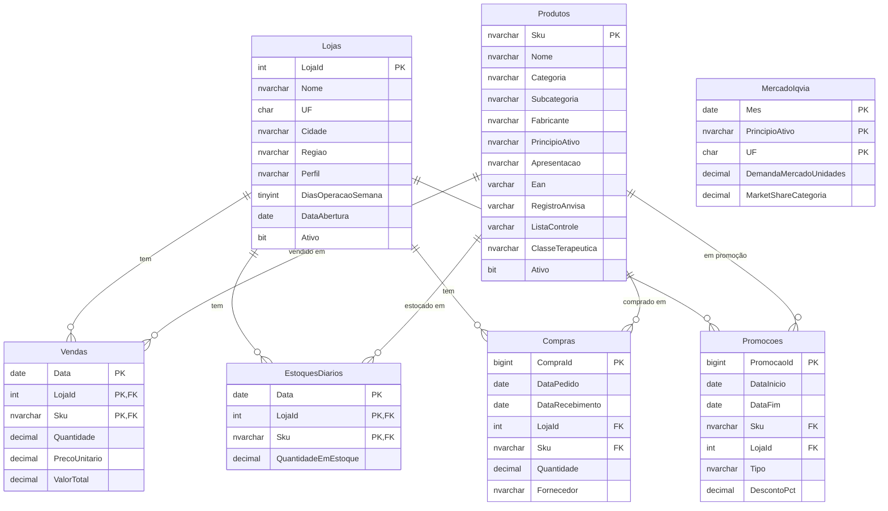
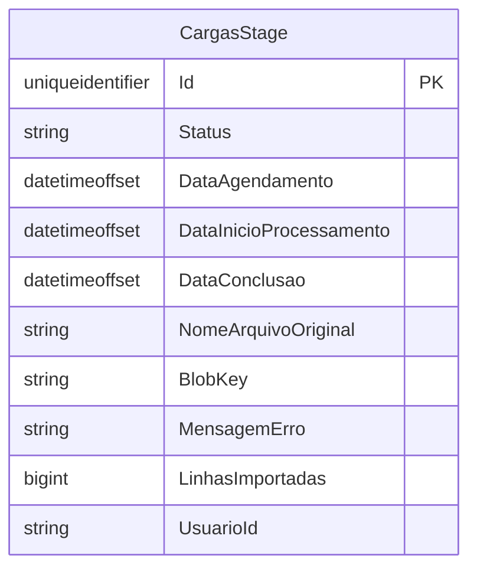

# Schema de Dados

> **Fonte da verdade:** o SQL Server Project [CosmosPro.ML.DemandForCast.Database](../CosmosPro.ML.DemandForCast.Database/) para o banco `Stage`, e o projeto [CosmosPro.ML.DemandForCast.Engine](../CosmosPro.ML.DemandForCast.Engine/) (EF Core migrations) para o banco `engine`. Este documento é uma referência de leitura — quando alterar schema, **altere o source-of-truth e atualize este doc no mesmo commit**.

Bancos do projeto:

| Banco | Servidor | Gerência | Documentado em |
|---|---|---|---|
| **`Stage`** | SQL Server | DACPAC (SQL Server Project) | §1 abaixo |
| **`engine`** | SQL Server | EF Core migrations + `Aspire.Hosting.EntityFrameworkCore.AddEFMigrations` | §2 abaixo |
| **`vendas-olap`** | ClickHouse | Runner one-shot customizado | [olap-schema-migrations.md](olap-schema-migrations.md) |

---

## 1. Banco `Stage` (staging area)

Staging area dos dados que o usuário importa via UI antes do engine consumir para feature engineering.

---

## Diagrama ER



`MercadoIqvia` não tem FK explícita — relaciona-se com `Produtos.PrincipioAtivo` por valor (denormalização proposital para o sinal de mercado mensal).

---

## Tabelas em detalhe

### `dbo.Lojas`

Mestre de pontos de venda da rede.

| Coluna | Tipo | Null | Descrição |
|---|---|---|---|
| `LojaId` | INT | NOT NULL | **PK**. Identificador da loja no ERP da rede. |
| `Nome` | NVARCHAR(120) | NOT NULL | Razão social ou nome fantasia. |
| `UF` | CHAR(2) | NOT NULL | Sigla do estado. |
| `Cidade` | NVARCHAR(100) | NOT NULL | Município. |
| `Regiao` | NVARCHAR(50) | NULL | Agrupamento interno (ex.: "Sul SP capital"). |
| `Perfil` | NVARCHAR(30) | NULL | Classificação operacional: `rua`, `shopping`, `popular`, `premium`. |
| `DiasOperacaoSemana` | TINYINT | NOT NULL | Default 7. Quantos dias por semana a loja opera. |
| `DataAbertura` | DATE | NULL | Data de inauguração. Útil para distinguir lojas novas (cold-start). |
| `Ativo` | BIT | NOT NULL | Default 1. Lojas fechadas ficam com `0` mas o histórico permanece. |

Sem índices secundários (PK é suficiente para o volume de lojas: dezenas a centenas).

---

### `dbo.Produtos`

Mestre de SKUs.

| Coluna | Tipo | Null | Descrição |
|---|---|---|---|
| `Sku` | NVARCHAR(30) | NOT NULL | **PK**. Código interno da rede (não EAN). |
| `Nome` | NVARCHAR(200) | NOT NULL | Nome comercial. |
| `Categoria` | NVARCHAR(80) | NULL | Ex.: "Medicamentos", "Higiene Pessoal". |
| `Subcategoria` | NVARCHAR(80) | NULL | Ex.: "Antitérmicos", "Antialérgicos". |
| `Fabricante` | NVARCHAR(120) | NULL | Indústria farmacêutica. |
| `PrincipioAtivo` | NVARCHAR(200) | NULL | Ex.: "Dipirona Sódica 500mg". Usado para join com `MercadoIqvia`. |
| `Apresentacao` | NVARCHAR(120) | NULL | Ex.: "20cp 500mg", "Frasco 100ml". |
| `Ean` | VARCHAR(14) | NULL | Código de barras (até 14 dígitos GTIN-14). |
| `RegistroAnvisa` | VARCHAR(20) | NULL | Número de registro ANVISA. |
| `ListaControle` | VARCHAR(10) | NULL | Portaria 344/98 ANVISA: `A1`, `A2`, `A3`, `B1`, `B2`, `C1`, `C2`, etc. `NULL` = não controlado. |
| `ClasseTerapeutica` | NVARCHAR(120) | NULL | Categorização terapêutica (ex.: ATC). |
| `Ativo` | BIT | NOT NULL | Default 1. |

**Índices:**
- `IX_Produtos_PrincipioAtivo` (filtered: `WHERE PrincipioAtivo IS NOT NULL`) — acelera join com `MercadoIqvia`.
- `IX_Produtos_Categoria` (filtered: `WHERE Categoria IS NOT NULL`) — acelera filtragem por hierarquia.

---

### `dbo.Vendas`

Vendas agregadas por (Data, LojaId, Sku). Granularidade diária. Detalhe de cupom **não** entra aqui — é irrelevante para forecast.

| Coluna | Tipo | Null | Descrição |
|---|---|---|---|
| `Data` | DATE | NOT NULL | **PK**. Data da venda. |
| `LojaId` | INT | NOT NULL | **PK**, **FK→Lojas**. |
| `Sku` | NVARCHAR(30) | NOT NULL | **PK**, **FK→Produtos**. |
| `Quantidade` | DECIMAL(12,3) | NOT NULL | Unidades vendidas. Decimal para suportar fracionamento (manipulação, blister fracionado). |
| `PrecoUnitario` | DECIMAL(12,4) | NOT NULL | Preço médio praticado no dia. |
| `ValorTotal` | DECIMAL(14,4) | NOT NULL | Receita do dia (já líquido de devolução). |

**Índices:**
- PK clustered em (Data, LojaId, Sku).
- `IX_Vendas_Sku_Data` (Sku, Data) INCLUDE (LojaId, Quantidade) — padrão de acesso típico de feature extraction (varrer histórico por SKU em janela temporal).

---

### `dbo.EstoquesDiarios`

Snapshot diário de estoque por (Data, LojaId, Sku). Crítico para identificar **ruptura** — sem essa tabela, o ML aprenderia "venda zero = demanda zero" mesmo quando o real foi "venda zero porque não tinha o produto".

| Coluna | Tipo | Null | Descrição |
|---|---|---|---|
| `Data` | DATE | NOT NULL | **PK**. |
| `LojaId` | INT | NOT NULL | **PK**, **FK→Lojas**. |
| `Sku` | NVARCHAR(30) | NOT NULL | **PK**, **FK→Produtos**. |
| `QuantidadeEmEstoque` | DECIMAL(12,3) | NOT NULL | Saldo fim-do-dia. `<= 0` indica ruptura. |

**Índices:**
- PK clustered em (Data, LojaId, Sku).
- `IX_EstoquesDiarios_Sku_Data` (Sku, Data) INCLUDE (LojaId, QuantidadeEmEstoque).

---

### `dbo.Compras`

Histórico de pedidos de suprimento. Permite calcular lead time real e validar pressuposto da política de compra.

| Coluna | Tipo | Null | Descrição |
|---|---|---|---|
| `CompraId` | BIGINT IDENTITY | NOT NULL | **PK** surrogate. |
| `DataPedido` | DATE | NOT NULL | Quando o pedido foi colocado no fornecedor. |
| `DataRecebimento` | DATE | NULL | Quando chegou. **`NULL`** = pedido em trânsito. |
| `LojaId` | INT | NOT NULL | **FK→Lojas**. |
| `Sku` | NVARCHAR(30) | NOT NULL | **FK→Produtos**. |
| `Quantidade` | DECIMAL(12,3) | NOT NULL | Quantidade pedida. |
| `Fornecedor` | NVARCHAR(120) | NULL | Nome do fornecedor (idealmente normalizado, mas para POC fica denormalizado). |

**Cálculo de lead time:** `DATEDIFF(day, DataPedido, DataRecebimento)` por SKU × Fornecedor (calculado em view ou no consumidor; não materializado).

**Índices:**
- PK clustered em CompraId.
- `IX_Compras_Sku_DataPedido` — acelera "todos os pedidos de um SKU".
- `IX_Compras_Sku_DataRecebimento` (filtered: `WHERE DataRecebimento IS NOT NULL`) — acelera estatísticas de lead time.

---

### `dbo.Promocoes`

Intervalos de promoção por SKU + opcionalmente loja. Feature crítica para o ML separar venda promocional de venda regular.

| Coluna | Tipo | Null | Descrição |
|---|---|---|---|
| `PromocaoId` | BIGINT IDENTITY | NOT NULL | **PK** surrogate. |
| `DataInicio` | DATE | NOT NULL | Início da promoção (inclusive). |
| `DataFim` | DATE | NOT NULL | Fim da promoção (inclusive). |
| `Sku` | NVARCHAR(30) | NOT NULL | **FK→Produtos**. |
| `LojaId` | INT | NULL | **FK→Lojas**. `NULL` = aplicada a todas as lojas (campanha nacional). |
| `Tipo` | NVARCHAR(50) | NULL | Ex.: `desconto`, `leve3pague2`, `queima`. |
| `DescontoPct` | DECIMAL(5,2) | NULL | 0-100. |

**Constraints:**
- `CK_Promocoes_Intervalo` — garante `DataInicio <= DataFim`.

**Índices:**
- PK clustered em PromocaoId.
- `IX_Promocoes_Sku_DataInicio` (Sku, DataInicio, DataFim) INCLUDE (LojaId, DescontoPct) — acelera "promoção vigente em data X para SKU Y".

---

### `dbo.MercadoIqvia`

Sinal exógeno de mercado farma. Granularidade **mensal** por princípio ativo × UF. Para POC sem licença IQVIA real, o schema é compatível com geração sintética calibrada.

| Coluna | Tipo | Null | Descrição |
|---|---|---|---|
| `Mes` | DATE | NOT NULL | **PK**. Primeiro dia do mês de referência (`yyyy-MM-01`). |
| `PrincipioAtivo` | NVARCHAR(200) | NOT NULL | **PK**. Junta com `Produtos.PrincipioAtivo` por valor. |
| `UF` | CHAR(2) | NOT NULL | **PK**. |
| `DemandaMercadoUnidades` | DECIMAL(18,3) | NOT NULL | Total estimado de unidades no mercado no mês × princípio ativo × UF. |
| `MarketShareCategoria` | DECIMAL(6,4) | NULL | 0 a 1. Fração da categoria representada pelo princípio ativo na UF. |

**Constraints:**
- `CK_MercadoIqvia_MarketShare` — `NULL OR (>= 0 AND <= 1)`.
- `CK_MercadoIqvia_DiaUm` — `DAY(Mes) = 1` (força semântica de "mês como primeiro dia").

**Sem FK** para `Produtos` — IQVIA é dimensão de mercado, não de catálogo da rede. Princípios ativos podem aparecer no IQVIA sem que a rede venda, e vice-versa.

---

## Convenções aplicadas neste banco

- **Identificadores em PT-BR plural** (negócio: `Vendas`, `Lojas`, etc.). Identifiers ASCII (sem cedilha) — `Promocoes`, não `Promoções`.
- **Tudo sob `dbo`** — sem schema custom dentro do DB (decisão deliberada para simplicidade).
- **Quantidades** em `DECIMAL(12,3)` para suportar fracionado.
- **Preços** em `DECIMAL(12,4)` para suportar centavos fracionados (algumas farmacêuticas trabalham com 4 casas).
- **Datas puras** em `DATE` (não `DATETIME`) — sem ruído de fuso horário; granularidade diária basta para forecasting.
- **NVARCHAR** para texto livre (suporta acentos); **VARCHAR** para códigos (EAN, ANVISA, lista de controle).
- **Nomenclatura de constraints:**
  - `PK_<Tabela>`
  - `FK_<Tabela>_<TabelaReferenciada>`
  - `IX_<Tabela>_<Colunas>`
  - `CK_<Tabela>_<Regra>`
  - `DF_<Tabela>_<Coluna>`
- **Inline indexes** dentro do `CREATE TABLE` (SQL Server 2014+).

---

## O que **não** entra neste banco

- **Calendário/feriados:** gerado proceduralmente em C# pelo feature engineering (sem tabela `Calendario`).
- **Lead time agregado:** calculado on-the-fly a partir de `Compras` (sem tabela materializada).
- **Curva ABC, classificação de giro:** derivado em runtime (sem tabela materializada).
- **Cargas / jobs de importação:** vivem na DB `engine` — ver §2.
- **Modelos treinados, métricas de backtest:** vivem na DB `engine` — ainda não implementadas.

---

## Quando alterar o schema do `Stage`

1. Alterar o `.sql` correspondente em [CosmosPro.ML.DemandForCast.Database/Tables/](../CosmosPro.ML.DemandForCast.Database/Tables/).
2. Build do `.sqlproj` (gera o `.dacpac`).
3. Próximo `aspire run` / F5 → o `stage-schema` aplica o diff automaticamente via SqlPackage (não é destrutivo por padrão; mudanças que perdem dados ficam bloqueadas e exigem flag explícita).
4. **Atualizar este doc no mesmo commit** — mantém o schema doc e o schema real em sync.

---

## 2. Banco `engine` (estado próprio do engine)

Banco que o engine **escreve** (oposto do `Stage`, que ele só lê). Gerenciado via **EF Core migrations**, aplicadas no boot do AppHost via [`Aspire.Hosting.EntityFrameworkCore.AddEFMigrations`](https://github.com/microsoft/aspire/blob/main/extension/README.md) (prerelease 13.3.4-preview).

### Diagrama ER



(Por enquanto só uma tabela. Crescerá com: `Experimentos`, `BacktestRuns`, `Modelos`, `Metricas` quando entrarmos em F3+).

### `dbo.CargasStage`

Job de importação de dados do usuário (ZIP de CSVs) para o banco Stage. Worker faz polling desta tabela com `WITH (UPDLOCK, READPAST)` (competing-consumers em SQL Server puro — ver [tcc-design.md §4](tcc-design.md)).

| Coluna | Tipo | Null | Descrição |
|---|---|---|---|
| `Id` | UNIQUEIDENTIFIER | NOT NULL | **PK**. GUID gerado no insert. |
| `Status` | NVARCHAR(20) | NOT NULL | Enum como string: `Pendente`, `Processando`, `Concluida`, `Falha`. |
| `DataAgendamento` | DATETIMEOFFSET | NOT NULL | Quando o usuário fez o upload via API. |
| `DataInicioProcessamento` | DATETIMEOFFSET | NULL | Quando o Worker pegou o job (Status passou para `Processando`). |
| `DataConclusao` | DATETIMEOFFSET | NULL | Quando terminou (sucesso ou falha). |
| `NomeArquivoOriginal` | NVARCHAR(260) | NOT NULL | Nome do arquivo que o usuário enviou (ex.: `import-2026-05-20.zip`). |
| `BlobKey` | NVARCHAR(260) | NOT NULL | Chave no bucket MinIO onde o ZIP foi salvo. |
| `MensagemErro` | NVARCHAR(2000) | NULL | Preenchido quando `Status = Falha`. |
| `LinhasImportadas` | BIGINT | NULL | Total de linhas carregadas somando todas as tabelas. Null antes da conclusão. |
| `UsuarioId` | NVARCHAR(100) | NULL | Placeholder para futuro modelo de autenticação. Hoje pode ser `"anonymous"`. |

**Índices:**
- PK clustered em `Id`.
- `IX_CargasStage_Status_DataAgendamento` (Status, DataAgendamento) — exatamente o padrão de acesso do Worker: `SELECT TOP 1 ... WHERE Status='Pendente' ORDER BY DataAgendamento WITH (UPDLOCK, READPAST)`.

**Tabela de controle do EF Core:** `__EFMigrationsHistory` (criada automaticamente pelo EF, registra migrations aplicadas).

### Wire-up

[ApiService/Program.cs](../CosmosPro.ML.DemandForCast.ApiService/Program.cs):
```csharp
builder.AddSqlServerDbContext<EngineDbContext>("engine");
```

[AppHost.cs](../CosmosPro.ML.DemandForCast.AppHost/AppHost.cs):
```csharp
apiService
    .AddEFMigrations("engine-migrations", "CosmosPro.ML.DemandForCast.Engine.EngineDbContext")
    .RunDatabaseUpdateOnStart();
```

Aspire executa `dotnet ef database update` contra o ApiService a cada `aspire run`. Migrations já aplicadas são ignoradas (mantidas via `__EFMigrationsHistory`).

### Quando alterar o schema do `engine`

1. Alterar/adicionar entidades em [CosmosPro.ML.DemandForCast.Engine/Entities/](../CosmosPro.ML.DemandForCast.Engine/Entities/) ou ajustar o `EngineDbContext`.
2. Gerar migration: `dotnet ef migrations add NomeDaMigration --project CosmosPro.ML.DemandForCast.Engine --startup-project CosmosPro.ML.DemandForCast.ApiService`.
3. Inspeção visual do arquivo gerado em `Migrations/` (revisar Up/Down).
4. Próximo `aspire run` → recurso `engine-migrations` aplica.
5. **Atualizar este doc no mesmo commit.**

**Importante:** o startup project é o `ApiService` (que tem `Microsoft.EntityFrameworkCore.Design` + DbContext registrado via DI). Sem ele, `dotnet ef` reclama de "design package missing".
